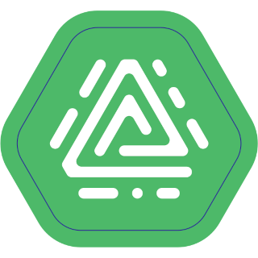

# IoBroker.acme
**Tests:** 

## ACME-Adapter für ioBroker
Dieser Adapter generiert Zertifikate mithilfe von ACME-Herausforderungen.

## Verwendung
Der Adapter startet regelmäßig (standardmäßig um Mitternacht) und nach Konfigurationsaktualisierungen, um alle erforderlichen Zertifikate (neue oder bald ablaufende) zu generieren.

Derzeit werden Bestellungen mit der Zertifizierungsstelle Let's Encrypt abgewickelt und sind somit kostenlos.

Zertifikatsdetails werden in einem „Zertifikatssammlungs“-Objekt gespeichert, das andere relevante Details wie Ablaufdatum, zu sichernde Domains und private Schlüssel enthält.
Auf diese Objekte wird durch ihre Sammlungs-ID verwiesen.

Adapter, die Zertifikate benötigen, um ihre Kommunikation zu sichern (z. B. [Webadapter](https://www.npmjs.com/package/iobroker.web)), können Zertifikatssammlungen laden und verwenden.

Die Speicherung und Nutzung erfolgt über eine im [Core ioBroker-Controller](https://www.npmjs.com/package/iobroker.js-controller) enthaltene Schnittstelle.

### ACME-Herausforderungen
Es sind zwei Methoden der Challenge-Überprüfung implementiert und mindestens eine sollte auf der Konfigurationsseite aktiviert werden.

Beachten Sie, dass Wildcard-Zertifikatsbestellungen nur mit der DNS-01-Challenge validiert werden können.

#### HTTP-01
Der Adapter startet seinen eigenen HTTP-01-Challenge-Server auf dem konfigurierten Port und der konfigurierten Adresse.

Damit eine HTTP-01-Challenge erfolgreich ist, **muss** der Port/die Adresse des Challenge-Servers als Port 80 des FQDN öffentlich erreichbar sein, der in einer Sammlung allgemeiner/alternativer Namen aus dem offenen Internet angegeben ist.

Konfigurieren Sie Ihre Firewall, Ihren Reverse-Proxy usw. entsprechend.

Beispielszenarien:

1. Der IoB-Host, auf dem ACME ausgeführt wird, befindet sich hinter einem Router und dieser Router hat eine öffentlich erreichbare IP-Adresse:

    Lösung:

    - Konfigurieren Sie ACME so, dass es auf jedem freien Port läuft: zB: 8092.
    - Konfigurieren Sie den Router so, dass Verbindungen an Port 80 seiner öffentlichen Adresse an Port 8092 des IoB-Hosts weitergeleitet werden.
    - Konfigurieren Sie den DNS-Namen des gewünschten allgemeinen Namens des Zertifikats, um ihn in die öffentliche Adresse des Routers aufzulösen.

2. Der IoB-Host, auf dem ACME läuft, hat eine direkte Internetverbindung mit einer öffentlich erreichbaren IP-Adresse:

    Lösung:

     - Konfigurieren Sie den ACME-Adapter so, dass er auf Port 80 auflistet.
     - Konfigurieren Sie den DNS-Namen des gewünschten allgemeinen Namens des Zertifikats, um ihn in die öffentliche Adresse des IoB-Hosts aufzulösen.

3. Szenario 1 & 2 sind unmöglich, da ein anderer Dienst auf Port 80 der öffentlich erreichbaren IP-Adresse läuft.

    Mögliche Lösungen:

    1. Wenn der andere Dienst ein IoB-Adapter ist, der den Namensstandards für Portkonfigurationen folgt, stoppt ACME ihn, bevor er versucht, ein Zertifikat anzufordern, verwendet Port 80 für den HTTP-01-Challenge-Server und startet jeden beendeten Adapter neu, wenn er fertig ist.

       Offensichtlich verursacht dies einen kurzen Ausfall für den anderen Adapter, was möglicherweise nicht erwünscht ist.

    2. Verwenden Sie eine DNS-01-Challenge.

    3. Richten Sie einen benannten virtuellen Host-HTTP-Proxy auf Port 80 des Routers oder öffentlich erreichbaren IoB-Hosts ein.

       - Geben Sie dem vorhandenen Dienst einen anderen Hostnamen als dem, für den ein Zertifikat erforderlich ist, und konfigurieren Sie diesen Hostnamen so, dass er in dieselbe Adresse aufgelöst wird.
       - Konfigurieren Sie den Proxy so, dass Anforderungen basierend auf dem verwendeten Namen entweder an den vorhandenen Dienst oder den ACME-Adapter weitergeleitet werden.

    4. Führen Sie ACME nur dann manuell aus, wenn der erforderliche Portzugriff verfügbar ist. **Nicht empfohlen**, sollte aber funktionieren:

        - Deaktivieren (stoppen) Sie den ACME-Adapter nach der Installation.
        - Kurz bevor eine Zertifikatsbestellung oder -erneuerung erforderlich ist (Erneuerung erfolgt bis zu 7 Tage vor Ablauf), führen Sie die folgenden Schritte manuell durch:
          - Richten Sie Firewalls/Portweiterleitungen/andere Wartungsarbeiten ein, die erforderlich sind, damit ACME auf dem konfigurierten Port ausgeführt werden kann und damit dieser Port über das öffentliche Internet zugänglich ist.
          – Starten Sie ACME manuell von der Seite „IoB-Verwaltungsinstanzen“.
          - Warten Sie, bis ACME alle Zertifikatsbestellungen abgeschlossen hat.
          – Stoppen Sie ACME manuell auf der Seite „IoB-Verwaltungsinstanzen“.
        - Diese Schritte sind jedes Mal erforderlich, wenn eine Zertifikatsbestellung/-erneuerung erforderlich ist, und daher wird diese Methode **nicht empfohlen**. ACME wurde entwickelt, um einen vollständig automatisierten Prozess zu ermöglichen.

#### DNS-01
Für beliebte Domain-Hosting-Plattformen sind verschiedene DNS-01-Challenge-Plugins implementiert.

#### Verweise
Siehe [AMCS.js](https://www.npmjs.com/package/acme) für weitere Einzelheiten.

## Changelog
<!--
    Placeholder for the next version (at the beginning of the line):
    ### **WORK IN PROGRESS**
-->

### **WORK IN PROGRESS**
* (raintonr) Use @iobroker/webserver (#10).
* (bluefox) Corrected detection of instances on the same port.

### 0.0.2 (2023-03-01)
* (bluefox) Now all running on the same port adapters will be stopped before update.

### 0.0.1 (2023-01-29)
* (Robin Rainton) Initial release.

## License
MIT License

Copyright (c) 2023 Robin Rainton <robin@rainton.com>

Permission is hereby granted, free of charge, to any person obtaining a copy
of this software and associated documentation files (the "Software"), to deal
in the Software without restriction, including without limitation the rights
to use, copy, modify, merge, publish, distribute, sublicense, and/or sell
copies of the Software, and to permit persons to whom the Software is
furnished to do so, subject to the following conditions:

The above copyright notice and this permission notice shall be included in all
copies or substantial portions of the Software.

THE SOFTWARE IS PROVIDED "AS IS", WITHOUT WARRANTY OF ANY KIND, EXPRESS OR
IMPLIED, INCLUDING BUT NOT LIMITED TO THE WARRANTIES OF MERCHANTABILITY,
FITNESS FOR A PARTICULAR PURPOSE AND NONINFRINGEMENT. IN NO EVENT SHALL THE
AUTHORS OR COPYRIGHT HOLDERS BE LIABLE FOR ANY CLAIM, DAMAGES OR OTHER
LIABILITY, WHETHER IN AN ACTION OF CONTRACT, TORT OR OTHERWISE, ARISING FROM,
OUT OF OR IN CONNECTION WITH THE SOFTWARE OR THE USE OR OTHER DEALINGS IN THE
SOFTWARE.