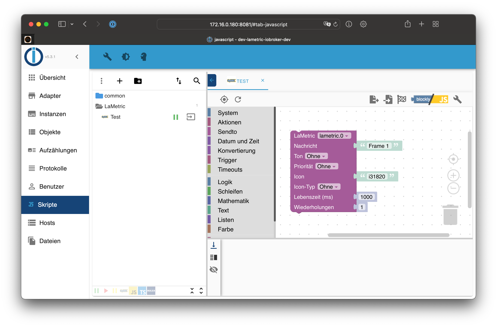
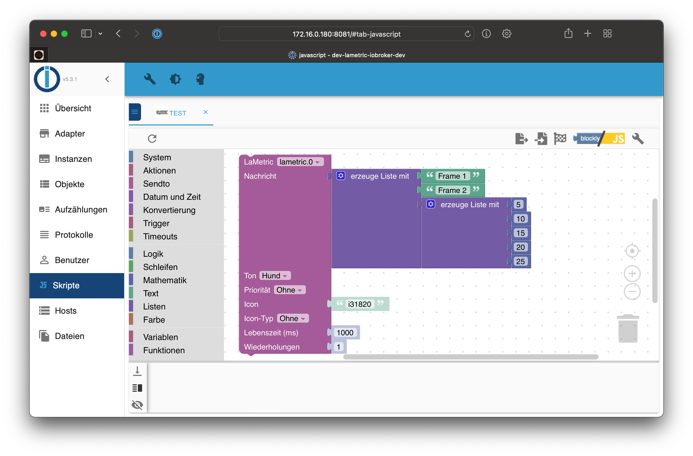

# ioBroker.lametric

## Blockly Beispiele

Senden eines einfachen Textes, welcher als einzelner Frame angezeigt wird

Um mehrere Frames darzustellen, kann eine Liste von Texten übergeben werden

Um Graphen darzustellen, muss ein Array aus Zahlen als Liste in einem Frame übergeben werden.

