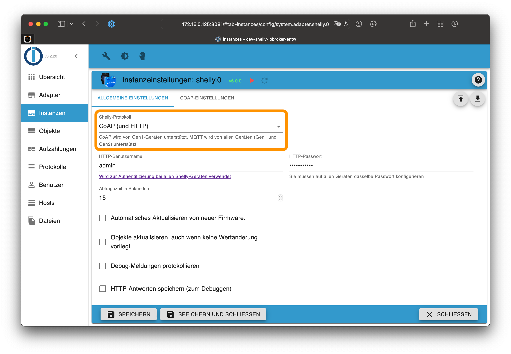

# ioBroker.shelly

## CoAP

Im Standard wird das CoAP-Protokoll verwendet.

Falls Du einen Shelly mit einer Firmware kleiner oder gleich 1.9.4 verwendest, ist keine weitere Konfiguration notwendig. Deine Geräte werden automatisch vom Adapter gefunden.

**Falls Du eine Version größer als 1.9.4 verwendest, musst Du einen CoIoT-Server für CoAP auf den Shelly-Geräten konfigurieren.** Trag als CoIoT-Server die IP-Adresse von deinem ioBroker Server ein - gefolgt von Port ```5683```. Wenn dein ioBroker beispielsweise unter der Adresse ```192.168.1.2``` erreichbar ist, trage dort ```192.168.1.2:5683``` ein und aktiviere CoIoT.

**Wichtig: Da CoAP Multicast UDP Pakete verwendet, müssen deine Shelly-Geräte im gleichen Subnetz wie dein ioBroker Server sein.**

Falls Du ioBroker in einem Docker-Container laufen hast, muss der Container im Netzwerkmodus ```host``` oder ```macvlan``` konfiguriert sein. Sollte der Docker-Container im Netzwerkmodus ```bridge``` laufen, werden keine Shelly-Geräte gefunden.



CoAP fügt alle Geräte in deinem Netzwerk hinzu. Falls Du einzelne Geräte ausschließen möchtest, kannst Du diese in der Blacklist konfigurieren. Füge dafür die Seriennummern in die Tabelle ein:


### Wichtige Hinweise

#### Shelly Firmware 1.8.0 (oder neuer)

- Falls Du das CoAP-Protokoll nutzt, muss ab dieser Version der Adapter in Version 4.0.0 (oder neuer) genutzt werden.
- Für Geräte mit älterer Firmware (außer Shelly 4 Pro) muss der Adapter in Version 3.3.6 (oder älter) genutzt werden. Die Adapter-Version 4.0.0 (oder neuer) ist nicht mit älteren Firmware-Versionen kompatibel!

#### Shelly Firmware 1.9.4 (oder neuer)

- Ab dieser Version muss ein CoIoT-Server auf jedem Shelly hinterlegt werden, falls das CoAP-Protokoll genutzt wird. Mehr Details im CoAP-Abschnitt in dieser Dokumentation.

### Fehlersuche

In manchen Fällen kann es vorkommen, dass der Shelly-Adapter nicht alle Geräte im CoAP-Modus findet. Versuche dann folgendes:

1. Stoppe deine Instanz des Shelly-Adapters. **Es ist nicht nötig, den Adapter zu deinstallieren!**
2. Öffne ein Terminal-Fenster und führe die folgenden Befehle auf dem ioBroker-Server aus:

```
cd /opt/iobroker/node_modules/iobroker.shelly/
node coaptest.js 
```

Alternativ kann ```tcpdump``` verwendet werden:

```
# Install tcpdump if it is not installed
sudo apt-get update
sudo apt-get install tcpdump

# tcpdump with IP address of Shelly device on network device eth1
sudo tcpdump -i eth1 src <IP-OF-SHELLY> and port 5683 -A   

# tcpdump with IP address of Shelly device 
sudo tcpdump src <IP-OF-SHELLY> and port 5683 -A

# tcpdump of all Shelly devices on network device eth1
sudo tcpdump  -i eth1 port 5683 -A

 # tcpdump of all Shelly devices
sudo tcpdump port 5683 -A
```

Nun solltest Du alle CoAP-Nachrichten von den Shelly-Geräten sehen. Solltest Du keine Nachrichten sehen, hast Du ein Netzwerkproblem mit UDP oder Multicast-Nachrichten.

CoAP-Nachrichten sehen wie folgt aus:

``` 
UDP Server listening on 0.0.0.0:5683
2020-08-19T19:33:29.484Z - 192.168.20.233:5683 - P-B3citsml	SHBTN-1#AXXXXXXXXXX#2RC{"G":[[0,9103,0],[0,2102,"S"],[0,2103,1],[0,3115,0],[0,3112,0],[0,3111,100],[0,9102,["button"]]]}
2020-08-19T19:33:29.827Z - 192.168.20.233:5683 - P-C3citsml	SHBTN-1#AXXXXXXXXXX#2RC{"G":[[0,9103,0],[0,2102,"S"],[0,2103,1],[0,3115,0],[0,3112,0],[0,3111,100],[0,9102,["button"]]]}
2020-08-19T19:33:33.942Z - 192.168.20.233:5683 - P-D3citsml	SHBTN-1#AXXXXXXXXXX#2RC{"G":[[0,9103,0],[0,2102,"S"],[0,2103,1],[0,3115,0],[0,3112,0],[0,3111,100],[0,9102,["button"]]]}
```