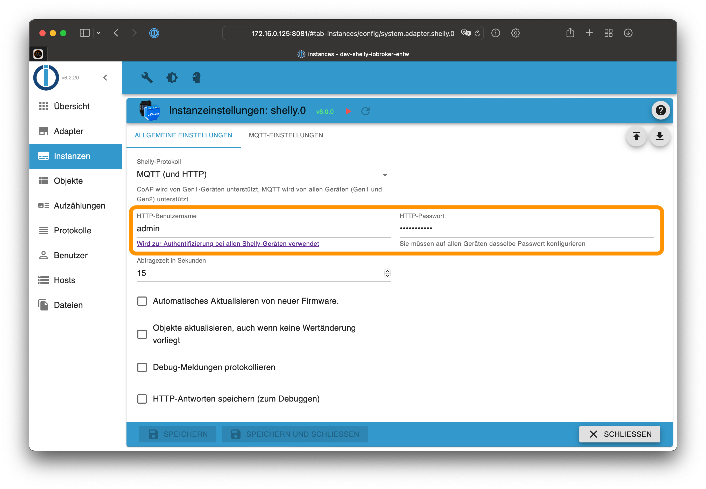

# ioBroker.shelly

## Geschützter Login

Um die Shelly-Geräte vor unbefugtem Zugriff zu schützen, setze in der ioBroker Konfiguration einen beliebigen Benutzernamen und Passwort im Tab *Allgemeine Einstellungen*.



Aktiviere danach den geschützten Zugriff auf allen Shelly-Geräten.

**Generation 2 bieten keine Option für einen Benutzernamen. Falls Du Gen 1 und Gen 2 Geräte nutzt, konfiguriere auf allen Geräten das gleiche Passwort.**

### Warnungen

Ist ein Geräte-Passwort im ioBroker konfiguriert, wird der Adapter Warnungen ins Log schreiben, falls einige Shelly-Geräte ungeschützt sind!

Um keine Warnungen mehr zu erhalten, kann entweder

- das Passwort in der Konfiguration des Adapters entfernt werden (= kein Passwort nötig) oder
- auf allen Shelly-Geräten der geschützte Zugriff aktiviert werden

### Generation 1 Geräte

1. Öffne die Shelly-Webkonfiguration in einem Browser (nicht in der Shelly App!)
2. Gehe zu ```Internet & Security settings -> Restricted Login```
3. Setze den Haken für den gesicherten Zugriff und gib die gerade konfigurierten Zugangsdaten ein
4. Speichere die Konfiguration - der Shelly startet automatisch neu
5. Stelle sicher, dass auf allen Shelly-Geräten die identischen Zugangsdaten konfiguriert werden


### Generation 2 Geräte (Plus und Pro)

1. Öffne die Shelly-Webkonfiguration in einem Browser (nicht in der Shelly App!)
2. Gehe zu ```Device -> Authentication```
3. Aktiviere das Passwort-Feature und gib das gerade konfigurierte Passwort ein
4. Speichere die Konfiguration

