# Proxmox 

## Proxmox Installation

Proxmox Virtual Environment (kurz Proxmox VE) ist eine auf Debian basierende Virtualisierungsplattform. Die Technik der Virtualisierung basiert bei Proxmox auf QEMU/KVM.

Proxmox „verpackt“ QEMU/KVM in eine eigenen Web-Oberfläche und macht die Administration damit recht einfach (und unterstützt darüber hinaus auch noch Linux Containers – LXC). Dadurch ist Proxmox auf der einen Seite einsteigerfreundlich, auf der anderen Seite aber auch so mächtig, dass es auch im professionellen Umfeld genutzt werden kann.

Dieser Abschnitt zeigt an einem Beispiel die Installation und Grundkonfiguration von Proxmox in der kostenlosen Variante (non-subscription).

Aufgrund der Übersichtlichkeit, sind Bildbeschreibungen und Zusatzinfo's zum aufklappen.

### Voraussetzungen

Voraussetzungen

   
- 64 Bit CPU
- CPU und Mainboard müssen Intel VT/AMD-V für die Virtualisierung unterstützen und im Bios aktiviert sein.
- 1 GB RAM (nur für Proxmox) – abhängig von der Anzahl der zu betreibenden virtuellen Maschinen wird hier natürlich mehr RAM benötigt. Daher sind hier minimal 8 GB, besser noch 16 GB RAM empfehlenswert.
   

### ISO Image/bootfähigen USB-Stick erstellen

Zunächst benöigt man ein ISO-Image, welches auf der [Proxmox-Download-Seite](https://www.proxmox.com/de/downloads/category/iso-images-pve) heruntergeladen werden kann.

Proxmox Iso

   

   

Zur Installation muss mit diesem ISO-Image noch ein bootfähiger USB-Stick erstellt werden. Dieser sollte dabei mindestens 2 GB Speicher haben. Zur Erstellung eines bootfähigen Sticks gibt es mehrere Möglichkeiten, siehe [Installationmedien vorbereiten](https://pve.proxmox.com/wiki/Prepare_Installation_Media#_instructions_for_windows)

### Installation

Das System muss im UEFI/BIOS so konfiguriert werden, dass von einem USB-Device gestartet werden kann. Nach dem Einstecken des USB-Sticks erscheint dann nach kurzer Zeit das Installations-Menü von Proxmox (falls nicht, kann man den USB-Stick auch manuell als Startmedium angeben (bei den meisten Mainboards kann man dies mit F8 oder F11 bewerkstelligen).

Im Installations-Menü wird nun einfach **Install Proxmox VE** ausgewählt.

Installations Menü

   

   

Im nächsten Schritt muss den Nutzungsbedingungen (EULA) zugestimmt werden.

Eula

   

   

Es folgt die Wahl der Festplatte, auf der Proxmox installiert werden soll. Falls mehrere Platten am Server installiert sind, sollte man hier darauf achten, auch die richtige Festplatte zu wählen!

Auswahl der Festplatte

   

   

Mit dem **Button Options** kann man auch noch weitere Parameter zur Installations-Festplatte angeben:

Erweiterte Optionen Festplatte

   
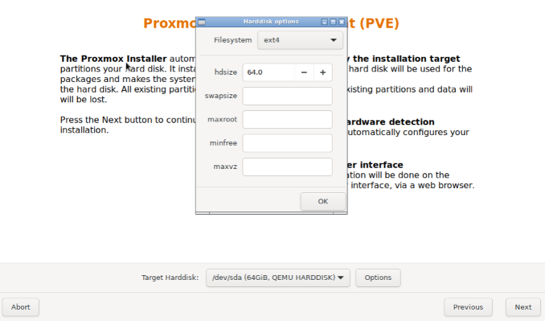
   

Proxmox nutzt den [Logical Volume Manager](https://de.wikipedia.org/wiki/Logical_Volume_Manager) (LVM). Mit den erweiterten Optionen an dieser Stelle kann u.a. das LVM in Detail konfiguriert werden.
Der Installer erstellt eine Volume Group (VG) mit dem Namen pve und zusätzliche Logical Volumes (LVs) mit den Namen root (hier wird Proxmox selbst installiert), data (Speicher, auf dem die virtuellen Platten der VMs gespeichert werden) und swap (hier wird das Swapfile gelagert).

Mit den erweiterten Einstellungen können hier gewisse Parameter angegeben werden:

- Filesystem: Hier kann man das Dateisystem wählen. Standard ist hier ext4 und in den meisten Fällen ist dies eine gute Wahl. Wenn mehrere Festplatten auf dem Host-System zur Verfügung stehen (und viel RAM), macht hier die Option zfs mit dem entsprechenden RAID-Level durchaus Sinn. In diesem Fall sollte man sich aber grundlegend mit ZFS beschäftigt haben.
- hdsize: Gibt Festplatten-Größe an, die für Proxmox insgesamt genutzt werden soll. Hier wählt man normalerweise die komplette Festplatten-Größe, es sei denn, man möchte später noch weitere Partitionen hinzufügen.
- swapsize: Bestimmt die Größe des Swap-Volumes. Standard ist hier die gleiche Größe wie der verbaute Speicher, jedoch minimal 4 GB und maximal 8 GB.
- maxroot: Gibt die maximal Größe des root-Volumes an(Proxmox selbst). **Hier ist zu erwähnen, das in der Grundinstallation, spätere benötigte Template's und Iso-Image's ebenfalls hier abgelegt werden.**
- minfree: Speicherplatz, der auf der LVM Volume Group pve freigelassen wird. Wenn die Festplatte größer als 128 GB ist, werden hier standardmäßig 16 GB frei gelassen (LVM benötigt immer etwas freien Speicher für die Erzeugung von Snapshots).
- maxvz: Legt die maximale Größe des data-Volumes fest.
   

Im Normalfall kann man hier alle Optionen auf der Standard-Einstellung belassen (d.h. hier wird nichts angegeben). Diese sind für die meisten Installationen bereits optimal eingestellt.

Nach der Wahl der Festplatte für Proxmox werden die Optionen zur Lokalisierung abgefragt (Land, Zeit und das dazugehörige Keyboard-Layout):

Lokalisierung

   

   

Im Anschluss wird das Passwort des root-Users eingegeben. Ebenso wird hier eine Mail-Adresse angefragt. Diese wird dazu verwendet, bei wichtigen Systemmeldungen eine E-Mail an die hier angegebene Adresse zu senden. Dies muss aber nicht zwingend eine echte E-Mail-Adresse sein (dann wird man als Admin aber nicht mehr per Mail auf wichtige Ereignisse des Systems hingewiesen).

Passwort und Email

   

   

Der nächste Schritt des Installers beschäftigt sich mit den Netzwerk-Einstellungen. Hier ist eine statische IP-Adresse anzugeben (kein DHCP). Dazu zählt die IP-Adresse selbst (als CIDR-Notation), die Gateway-IP (normalerweise die IP-Adresse des Routers) und der zu verwendende DNS-Server (im privaten Umfeld meist auch die IP-Adresse des Routers). Proxmox erkennt meist das Netzwerk automatisch.

Netzwerk

   
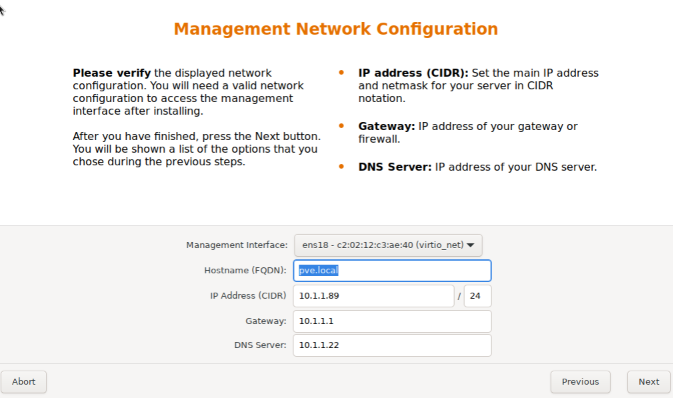
   

Am Ende wird noch eine Zusammenfassung der Installation angezeigt:

Zusammenfassung

   

   

Durch eine Kontrolle der Einstellungen und einem Klick auf Install wird das System installiert.

Installation

   

   

Nach einer kurzen Wartezeit ist die Installation abgeschlossen und das System muss neu gebootet werden (dazu vorher den USB-Stick mit dem ISO-Image entfernen).

Anschließend sieht man das Terminal. Hier wird schon die Anweisung angezeigt, wie nun auf das System zugegriffen werden kann:

Konsole

   

   

Nun geht es im Browser weiter (beispielhaft https://10.1.1.89:8006). Als erstes wird allerdings eine Warnung angezeigt. Dies liegt daran, dass während der Installation ein selbst signiertes Zertifikat erzeugt wurde, welches dem Browser natürlich nicht bekannt ist. Diese Meldung kann man an dieser Stelle getrost ignorieren – die Verbindung ist auf jeden Fall über HTTPS verschlüsselt. Die Meldung ansich, ist Browserabhängig. In diesem Beispiel, ein Klick auf **Erweitert** und anschließend auf **Weiter zu 10.1.1.89(unsicher)**

Datenschutzfehler

   

   

Die Anmeldung erfolgt dann mit dem User root und dem während der Installation gewähltem Passwort. Die Sprache kann man hier **zuerst** auf Deutsch umstellen, ansonsten wird die Oberfläche von Proxmox in Englisch angezeigt und man muss Benutzername und Kennwort nicht ein zweites mal  eingeben.

Anmeldung

   
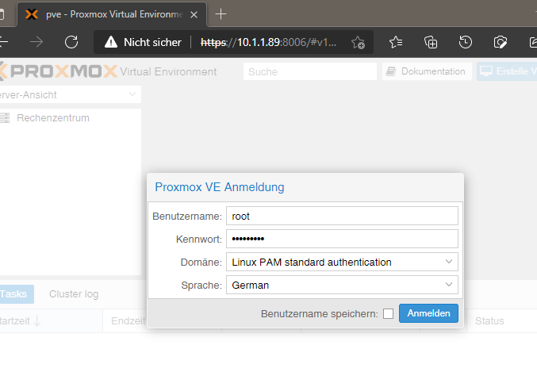
   

Direkt nach dieser Anmeldung wird man von einer Meldung begrüßt, dass man keine gültige Subscription für diesen Server hat. Diese Meldung wird erst einmal mit einem Klick auf OK bestätigt.

Subscription

   

   

Nun müssen die Proxmox Paketquellen angepasst werden, damit man Updates erhalten kann.

Paketquellen

   

   

Dazu wird das **Non-Subscription-Repository** zu den Paketquellen hinzugefügt. Dies kann im Menü der Proxmox-Instanz unter `Updates > Repositories` erledigt werden. Über den Button Hinzufügen kann das Non-Subscription-Repository hinzugefügt werden:

Non-Subscription

   

   

Nun sollte noch das **Enterprise-Repository** deaktiviert werden. Dazu einfach in der Repository-Ansicht das Repo pve-enterprise anwählen und auf den Button **Deaktivieren** klicken.

Die Konfiguration der Repositories sieht danach dann so aus:

Enterprise-Repository

   

   

### Updates
Nachdem die Paketquellen umgestellt wurden, sollte im Anschluß ein erstes System Update durchgeführt werden. Hier geht man am besten über die Web-Oberfläche:

Updates

   

   

Einfach den gewünschten Proxmox-Knoten aussuchen (z.B. „pve“) und dann unter Updates auf **Aktualisieren** klicken. Hier öffnet sich dann der sog. Task Viewer, der immer angezeigt wird, wenn irgendwelche Aktivitäten am System durchgeführt werden. Der Task-Viewer kann nun wieder geschlossen werden. Übrigens muss bei der Anzeige des Task-Viewers nicht gewartet werden, bis der Task abgeschlossen wurde („TASK OK“), sondern dieser Dialog kann immer direkt wieder geschlossen werden – der Task an sich läuft im Hintergrund weiter.
Falls nun Updates verfügbar sind, können diese mit einem Klick auf **Upgrade** eingespielt werden.

Hier öffnet sich dann die Web-Konsole und man kann den Fortschritt beobachten.

Web-Konsole

   

   

Es ist natürlich auch möglich, den Proxmox-Server über die Kommandozeile (z.B. per SSH) upzudaten:

~~~
apt update && apt dist-upgrade
~~~

Wichtig ist hier nur, dass man ein **apt dist-upgrade** verwendet (auf „normalen“ Debian/Ubuntu-Maschinen nutzt man ja eher apt upgrade). Das „dist-upgrade“ ist bei Proxmox allerdings wichtig, da hier Abhängigkeiten besser aufgelöst werden, die zum Betrieb von Proxmox benötigt werden.

Insofern ist Proxmox nun in seiner Grundkonfiguration abgeschlossen. Wenn man sich ausgiebiger mit Proxmox beschäftigen möchte, lohnt ein Blick ins [Proxmox Wiki](https://pve.proxmox.com/wiki/Main_Page) bzw. ins [offizielle Forum](https://forum.proxmox.com/).

---

## Proxmox - Erstellen einer Virtuellen Qemu/KVM-Maschine (VM) + ioBroker Installation im Anschluß

Diese Beispiel-Anleitung zeigt wie eine [VM](https://pve.proxmox.com/wiki/Qemu/KVM_Virtual_Machines) (debian11) erstellt und anschließend ioBroker darin installiert wird.

Es ist natürlich möglich anstatt Debian auch ein Ubuntu zu verwenden, jedoch ist hierbei darauf zu achten, eine Ubuntu Server **LTS Version** zu verwenden.

Aufgrund der Übersichtlichkeit, sind Bildbeschreibungen und Zusatzinfo's zum aufklappen.

### 1 - ISO-Image herunterladen

Zuerst wird ein [ISO-Image](https://www.debian.org/distrib/)(64-Bit-PC Netinst-ISO) benötigt, welches in der Grundinstallation (sofern keine weiteren Laufwerke angelegt wurden) ins root Verzeichnis (local) geladen werden muss.

Hierzu geht man auf local > ISO-Images. Dort gibt es zwei Möglichkeiten.

- Über den Button **Hochladen** kann die ISO, welche zuvor auf dem Rechner abgelegt wurde, auf den Proxmox Host geladen werden.
- **Von URL herunterladen** ist es möglich, die ISO direkt per URL auf den Host zu laden. Dazu kopiert man sich die Link Adresse der 64-Bit-PC Netinst-ISO(rechte Maustaste), fügt die URL ein und mit einem Klick auf **URL abfragen** wird diese abgerufen. Mit einem abschliessenden Klick auf **Herunterladen**, wird nun die ISO direkt heruntergeladen.

ISO herunterladen

### 2 - VM erstellen

Mit einem Klick auf den blauen Button **Erstelle VM** öffnet sich ein Fenster, in dem folgende Einstellungen getroffen werden müssen.

- Allgemein: Vergabe des Hostname und Passwort, ID wird vorgegeben (beginnt mit 100), kann geändert werden, jedoch nicht nachträglich.
- OS: Storage Auswahl(local) und ISO-Image(debian-11-netinst.iso)
- System: bleibt alles in der Standardeinstellung, **Qemu Agent Haken setzen**
- Disks: Storage local-lvm, Disk-Größe 10GB (10-20GB sollten ausreichend sein, ein nachträgliches Ändern ist möglich, wird jedoch hier nicht weiter beschrieben).
- CPU: Ist abhängig wie Leistungsstark der Rechner ist (kann ebenfalls jederzeit angepasst werden, VM muss dazu neu gestartet werden)
- Speicher: Ramgröße im MiB (kann ebenfalls jederzeit angepasst werden, VM muss dazu neu gestartet werden)
- Netzwerk: vmbr0, alles andere bleibt wie vorgegeben
- Bestätigen: Hier sieht man noch einmal eine Zusammenfassung, (Haken setzen bei **Nach Erstellen starten**) anschließend wird mit einem Klick auf **Abschließen** die VM erstellt.

Bilderserie Erstelle VM

### 3 - Debian Install

Nachdem die VM gestartet wurde, begibt man sich nun auf die Konsole der VM und startet den **Install**.

Konsole

Hierbei wird man durch die Installation geführt und muss währenddessen einige Einstellungen tätigen. Zur Bedienung benötigt man die Tab-, Leer- und Pfeiltasten. Aufgrund des Umfangs sind diverse Einstellungen der Bilderserie zu entnehmen.

**ACHTUNG! - Es darf kein root Passwort vergeben werden.**

Hinweis:

**iobroker** nicht als Benutzernamen wählen, da dieser schon Systemintern verwendet wird.

Bilderserie Debian Install

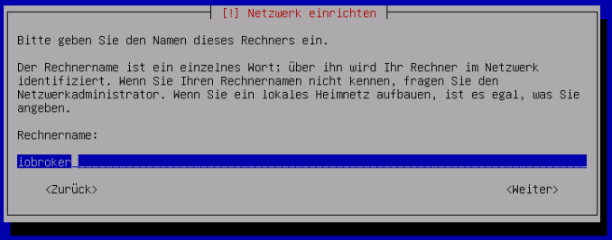

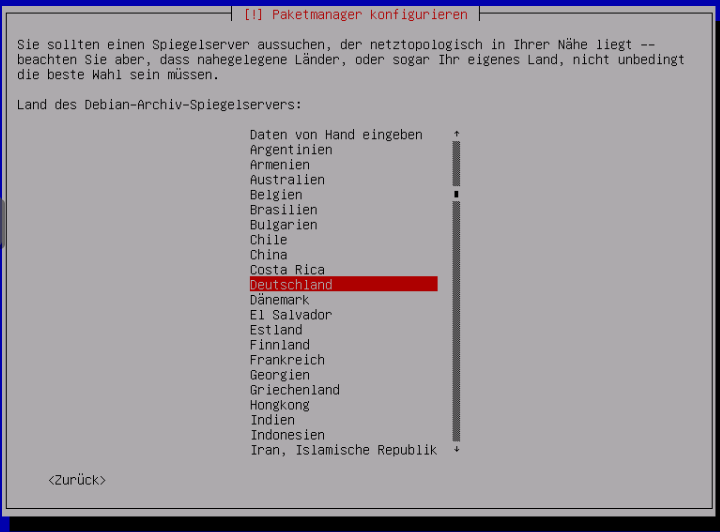

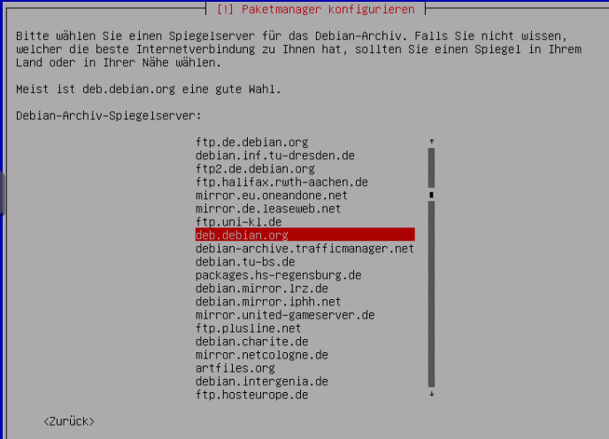

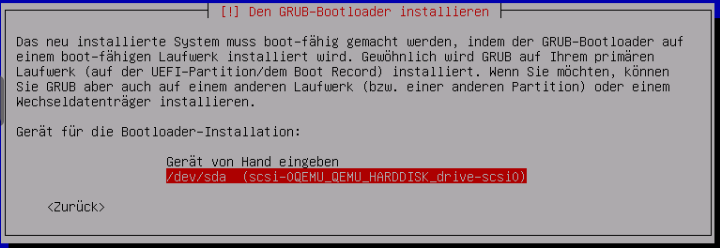

### 4 - VM einrichten

VM neustarten, danach loggt man sich mit dem aus der Installation vergebenen "Benutzername" und "Passwort" ein. Anschliessend wird mit dem Befehl

~~~
ip addr
~~~

die IP Adresse ausfindig gemacht. Diese wird benötigt, um wie im nächsten Schritt, sich remote per ssh mit der VM zu verbinden.

ip addr

Nun kann per ssh (z.b. Putty) auf die VM zugegriffen werden. Hier loggt man sich ebenfalls wieder mit "Benutzername" und "Passwort" ein.
Anschließend kann die Netzwerkadresse von **dhcp** auf **statisch** geändert werden. (was bei Serverbetrieb zu empfehlen ist)

~~~
sudo nano /etc/network/interfaces
~~~

network/interfaces

Änderungen im Editor werden mit der Tastenkombination STRG + o , danach ENTER, gespeichert, STRG + x beendet den Editor.

Änderungen der IP werden erst nach einem Neustart der VM wirksam. Zuvor wird jedoch noch geprüft, ob der Qemu-Guest-Agent aktiv ist, mittels

~~~
sudo systemctl status qemu-guest-agent
~~~

Guest-Agent

**ACHTUNG! - Bei Ubuntu Installationen muss der Qemu-Guest-Agent nachinstalliert und gestartet werden..**

Befehle dazu:

~~~
sudo apt-get install qemu-guest-agent
sudo systemctl start qemu-guest-agent
~~~

Desweitern, um iobroker installieren zu können, muss **curl** noch nachinstalliert werden.
~~~
sudo apt install curl
~~~

curl nachinstallieren

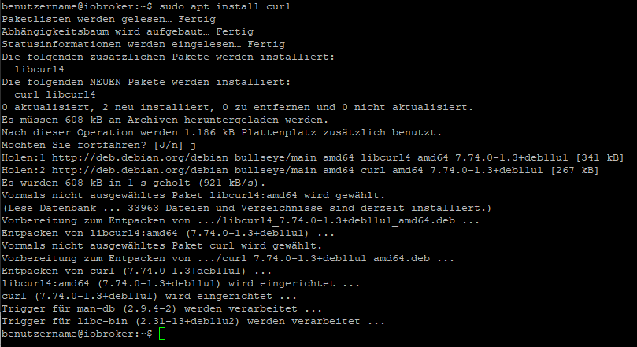

Um Geräte(USB) in einer VM durchzureichen, wählt man die VM > Hardware > Hinzufügen > USB-Geräte > Hersteller/Geräte ID. Hier werden alle angeschlossenen Geräte gelistet.

USB-Geräte

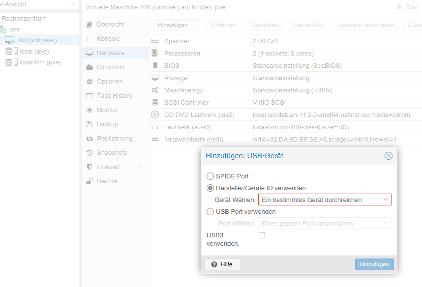

Damit die VM auch nach einem reboot des Rechners(Proxmox) automatisch startet, muss dies in den Optionen der VM noch aktiviert werden.

Option booten

Somit ist die Installation und Einrichtung der VM abgeschlossen. Nun kann die VM neu gestartet und im Anschluß ioBroker installiert werden.

---

## Proxmox - Erstellen eines Linux Containers (LXC) + ioBroker Installation im Anschluß

Diese Beispiel-Anleitung zeigt wie ein [LXC Container](https://pve.proxmox.com/wiki/Linux_Container) (debian11) erstellt und anschließend ioBroker darin installiert wird.

Aufgrund der Übersichtlichkeit, sind Bildbeschreibungen und Zusatzinfo's zum aufklappen.
 
### 1 - Container Template herunterladen

Zuerst wird ein Template benötigt, welches in der Grundinstallation (sofern keine weiteren Laufwerke angelegt wurden) ins root Verzeichnis (local) geladen werden muss.

Hierzu geht man auf local > Container Templates. Mit einem Klick auf **Templates** öffnet sich eine Auswahliste. Hier wählt man debian-11-standard(bullseye) und klickt auf herunterladen.

Template herunterladen

### 2 - LXC erstellen

Mit einem Klick auf den blauen Button **Erstelle CT** öffnet sich ein Fenster, in dem nun folgende Einstellungen getroffen werden müssen.

- Allgemein: Vergabe des Hostname und Passwort, ID wird vorgegeben (beginnt mit 100), kann jedoch geändert werden.
- Template: Storage Auswahl(local) und Template(debian-11-standard)
- Disks: Vergabe der Diskgröße(nicht zu großzügig sein, vergrößern kann man jederzeit)
- CPU: Ist abhängig wie Leistungsstark der Rechner ist (kann ebenfalls jederzeit angepasst werden)
- Speicher: Ram/Swap-Vergabe (kann jederzeit, auch im laufendem Betrieb angepasst werden)
- Netzwerk: statische IP/CIDR Vergabe, Gateway, sofern kein Ipv6 eingerichtet, wird dies auf SLAAC gestellt
- DNS: wird in der Regel nichts verändert(verwende Werte vom Host)
- Bestätigen: Zusammenfassung, (Haken setzen bei **Nach Erstellen starten**) anschließend wird mit einem Klick auf **Abschließen** der Container erstellt.

Bilderserie Erstelle CT

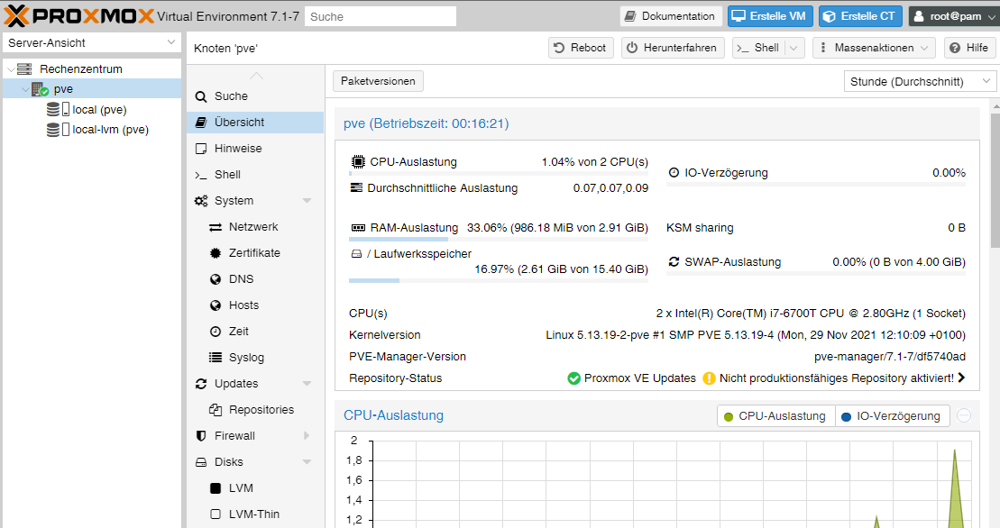

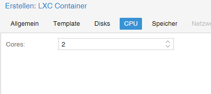

### 3 - LXC einrichten

Nachdem der Container nun gestartet wurde, begibt man sich auf die Konsole des LXC

Konsole

Hier loggt man sich zunächst als root mit dem zuvor vergebenen Passwort, welches beim LXC erstellen vergeben wurde, ein und bringt diesen erst einmal auf einen aktuellen  Stand.

~~~
apt update && apt upgrade
~~~

Upgrade

Hierbei wird direkt darauf hingewiesen, das die Zeitzone noch eingestellt werden muss.

~~~
dpkg-reconfigure tzdata
~~~

Zeitzone

Nun wird **sudo** und **curl** nachinstalliert. Sudo wird benötigt, um wie im nächsten Schritt, einen Benutzer korrekt anzulegen, mit dem zukünftig auf der Konsole gearbeitet wird. Curl ist nötig, um im letzten Schritt das IoBroker Installationsscript abzurufen.

~~~
apt install sudo curl
~~~

Nachinstallieren

Jetzt legt man den zukünftigen Benutzer an. "Benutzername" in dem Fall ersetzen. Passwortvergabe für den User. Der Rest kann mit ENTER bestätigt werden.

Hinweis:

**iobroker** nicht als Benutzernamen wählen, da dieser schon Systemintern verwendet wird.

~~~
adduser benutzername
~~~

Anschließend muss der User noch der sudo Gruppe zugeordnet werden.

~~~
usermod -aG sudo benutzername
~~~

User anlegen

Im letzen Schritt, bevor ioBroker installiert wird, einmal ausloggen

~~~
exit
~~~

und anschließend mit den Neuen Benutzer einloggen. Im Anschluß kann iobroker jetzt installiert werden.

ausloggen und mit Benutzer anmelden

Damit der LXC auch nach einem reboot des Rechners(Proxmox) automatisch startet, muss dies in den Optionen des Containers noch aktiviert werden.

Option booten

---

## ioBroker installieren

Für die Installation von ioBroker benötigt man lediglich einen einzigen Befehl.

~~~
curl -sLf https://iobroker.net/install.sh | bash -
~~~

Die Installationschritte dabei, sind in 4 Schritten unterteilt, welche vollautomatisch durchlaufen.

- Installing prerequisites (1/4)
- Creating ioBroker user and directory (2/4)
- Installing ioBroker (3/4)
- Finalizing installation (4/4)

Installer

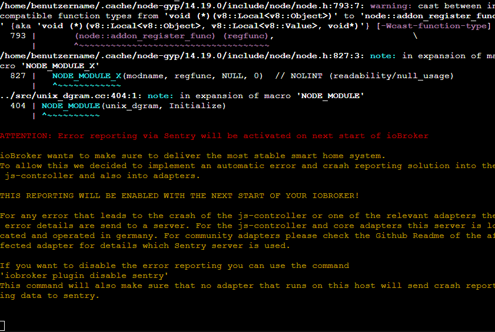

Die Installation ist erfolgreich abgeschlossen, wenn am Ende folgendes erscheint.

~~~
ioBroker was installed successfully
Open http://10.1.1.222:8081 in a browser and start configuring!
~~~

Dies bedeutet auch zugleich, das über die Adresse, ioBroker nun im Browser aufgerufen werden kann. Wenn alles problemlos funktioniert hat, wird man mit dem ioBroker-Setup berüßt. Nun sind es nur noch ein paar Schritte, durch die man mit dem Assistenten geleitet wird.

Bilderserie ioBroker Assistent

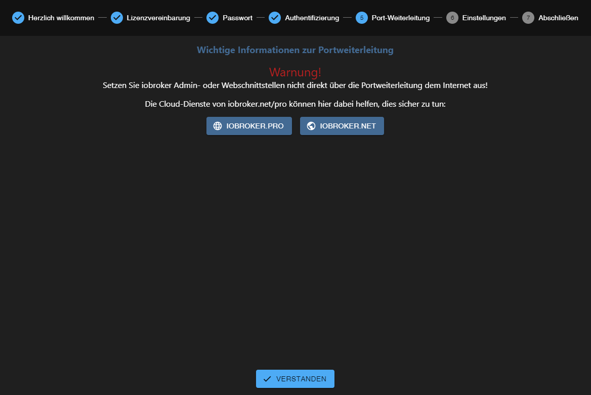

Im Anschluss hat man noch die Möglichkeit, nach Geräten und Diensten suchen zu lassen. Benötigte Adapter/Instanzen können dadurch automatisch angelegt werden.

Bilderserie Geräte/Dienst Suche

   

Somit ist die ioBroker Installation beendet. Weitere Adapter können je nach Anwendungsfall und Wunsch, jederzeit zusätzlich installiert werden.

---
   
## Proxmox - LXC (Linux Containers) -> USB Geräte durchreichen

Dieser Teil der Anleitung erklärt Schritt für Schritt das durchreichen eines USB-Gerätes (USB Passthrough) in Proxmox an einen LXC (Linux Container).

Bei einer VM ist das durchreichen eines USB-Gerätes direkt über die Web Oberfläche von Proxmox möglich, bei einem Linux Container muss hierfür aktuell noch manuell die Konfigurationsdatei des lxc bearbeitet werden. 

In der Anleitung wird das Einbinden eines **Texas Instruments Inc. CC2531** Zigbee Stick beschrieben, dieselben Schritte können aber analog für andere Zigbee Sticks (ConBee, CC2652P etc.) oder für andere USB-Geräte mit der Ausnahme von USB Netzwerk Geräten (Bluetooth/Wlan) verwendet werden.

* Für diesen Teil der Anleitung wurde Proxmox in der Version 7.1 verwendet. 

### 1.) Informationen zum USB-Gerät sammeln

Aufbau einer SSH-Verbindung zu Proxmox:

~~~
ssh root@IP-Adresse
~~~

**Sollte das USB-Gerät bereits mit dem Proxmox Host verbunden sein, stecke das Gerät vorerst ab.**

Mit folgendem Befehl werden alle aktuell verbunden USB-Geräte am Proxmox Host aufgelistet: 

~~~
lsusb
~~~
 

Nun wird das zu einbindende USB-Gerät am Proxmox Host eingesteckt und der Befehl lsusb erneut ausgeführt

 

Im Screenshot ist zusehen das ein neues Gerät mit der USB-Bus-Nummer: **001** und der Device-Nummer: **003** gelistet wird.

Diese Informationen werden benötigt um mit dem folgenden Befehl u. a. die **major device number** vom Gerät auszugeben:

~~~
ls -l /dev/bus/usb/001/003
~~~

Wichtig verwende bei dem Befehl die Ausgabe deiner USB-Bus-Nummer und Device-Nummer!

***ls -l /dev/bus/usb/USB-Bus-Nummer/Device-Nummer***

Das USB-Gerät hat in diesem Beispiel die major device number **189**, notiere dir den Wert deines Gerätes in einer Textdatei mit dem Vermerk: #1

 
Als nächstes geben wir die unique id des USB-Gerätes aus und notieren den Ausgabe Wert in der Textdatei mit dem Vermerk: #2
 
~~~
ls /dev/serial/by-id/
~~~

 
Als letzten Schritt wird die major device number des ttyACM ausgegeben und mit dem Vermerk: #3 notiert:

~~~
ls -l /dev/ttyACM*
~~~

 
>*Sollte hierbei keine Ausgabe erfolgen, prüfe mit „ls -l /dev/serial/by-id/“ ob das USB-Gerät vom System als ttyUSB eingebunden wird, wenn ja ersetze alle folgenden Befehle die sich auf **ttyACM…** beziehen durch **ttyUSB…**  sollte keine Ausgabe erscheinen ist es kein USB CDC class Gerät (Serielle Kommunikation) damit können alle Punkte zum Einbinden vom ttyACM ignoriert werden.*

Somit haben wir **drei** Werte vom USB-Gerät notiert die für das Einbinden in der Konfigurationsdatei des lxc benötigt werden.
 

###  2.) LXC Konfigurationsdatei bearbeiten

Am Proxmox Host ins LXC Konfigurationsverzeichnis wechseln mit:

~~~
cd /etc/pve/lxc
~~~

Die Konfigurationsdatei hat die gleiche ID Nummer die bei der Erstellung des lxc vergeben wurde!
 

 
Bevor die Konfigurationsdatei bearbeitet wird, sollte eine Sicherheitskopie erstellt werden:

~~~
cp 201.conf 201.conf.backup
~~~

 
Nun wird die Konfigurationsdatei mit vi oder nano bearbeitet:

~~~
nano 201.conf
~~~
 

Ans Ende der Konfigurationsdatei wird folgendes hinzugefügt:

~~~
lxc.cgroup2.devices.allow: c 189:* rwm
lxc.mount.entry: usb-Texas_Instruments_TI_CC2531_USB_CDC___0X00124B0012023529-if00 dev/serial/by-id/usb-Texas_Instruments_TI_CC2531_USB_CDC___0X00124B0012023529-if00 none bind,optional,create=file

lxc.cgroup2.devices.allow: c 166:* rwm
lxc.mount.entry: /dev/ttyACM0 dev/ttyACM0 none bind,optional,create=file
~~~

Ersetze die markierten Werte mit den vermerkten Einträgen aus deiner Notiz!

* Die erste Zeile bezieht sich auf die major device number **189** Vermerk: #1
* In der zweiten Zeile wird die unique id (usb-Texas_Instruments_TI_CC2531_USB_CDC___0X00124B0012023529-if00) aus Vermerk: #2 einzeln und mit dem absoluten Pfad angegeben, beachte das der komplette Text in einer Zeile ohne Zeilenumbruch geschrieben wird.
* In der dritten Zeile wird die major device number **166** von ttyACM aus Vermerk: #3 angegeben.

Die Konfigurationsdatei abspeichern (Im Nano Editor mit der Tastenkombination: STRG + o & STRG + x zum beenden des Editors)

   

**ACHTUNG! - Sollte dein Container aktive Snapshots besitzen:**

Dann gehört der lxc.cgroup Code nicht an das Ende der Config Datei sondern vor den ersten Eintrag eines Snaphots. 

**ACHTUNG! - Proxmox Installation vor Version 7.0:**

Ersetze die Einträge mit
   
~~~
lxc.cgroup2
~~~   

durch
   
~~~
lxc.cgroup
~~~

   
Abschließend noch folgenden Befehl absetzen um die benötigten Rechte für ttyACM0 zu setzen:

~~~
chmod o+rw /dev/ttyACM*
~~~

Um die Anpassungen am lxc zu übernehmen einen cold boot vom Container mit **pct stop id / pct start id** durchführen:

~~~
pct stop 201
~~~

~~~
pct start 201
~~~

   

**Tipp lege dir eine Kopie deiner funktionierenden Config Datei am besten extern ab, da z. B. der integrierte Proxmox Backup Dienst nicht den Inhalt deiner Config mit sichert!**

   

### 3.) LXC USB Passthrough prüfen & Zigbee Instanz Konfiguration

Aufbau einer SSH-Verbindung zum LXC:

~~~
ssh Benutzer@IP-Adresse
~~~

Mit den befehlen:

~~~
lsusb
~~~

&

~~~
ls -l /dev
~~~

wird überprüft ob die Anpassungen an der Konfigurationsdatei erfolgreich waren.
 

 
* Wie im Screenshot zu sehen hat nun der Container Zugriff auf das USB-Gerät.

* Wichtig hierbei ist das ttyACM0 die gleichen Rechte hat im Screenshot also **crw-rw-rw- 1 nobody nogroup**
>***Wenn nicht überprüfe ob alle Werte in der Konfigurationsdatei so gesetzt sind wie beschrieben, sollten die Rechte dann immer noch nicht übereinstimmen springe zu Punkt 5.***

* Im Screenshot ist ebenfalls zusehen das sich die Device Nummer vom cc2531 von dem Wert 3 auf 4 verändert hat, dies liegt daran das der Stick zwischenzeitlich einmal aus- und wieder angesteckt wurde. Da in der Konfigurationsdatei aber die unique id und nicht die Bus/Device Nummer angegeben ist funktioniert der USB Passthrough weiterhin.

Wird wie eingangsbeschrieben ein Zigbee Stick an den Container durchgereicht muss im iobroker in den Einstellungen des Zigbee Adapters unter dem Punkt COM-Anschlussname

~~~
/dev/ttyACM0
~~~

angegeben werden damit das korrekte Gerät vom Adapter angesprochen wird.
 

### 4.) UDEV Regel für permanente Rechte Anpassung von ttyACM0

Am Ende von Schritt 3 wurde mit dem Befehl 

~~~
chmod o+rw /dev/ttyACM*
~~~

die passenden Rechte für ttyACM0 gesetzt, diese Rechte Änderungen werden aber mit Neustart des Proxmox Host zurückgesetzt, für eine permanente Anpassung wird auf dem Proxmox Host eine udev Regel benötigt. 

Mit lsusb listen wir wieder die aktuell verbunden USB-Geräte auf:

~~~
lsusb
~~~

 
Diesmal notieren wir uns die Zahlenwerte Werte nach ID in diesem Fall also **0451:16a8**

* Der erste Wert: ***0451*** steht hierbei für den **idVendor** und der zweite Wert: ***16a8*** für **idProduct**.

Nun wird mit vi oder nano die udev Regel unter /etc/udev/rules.d erstellt:

~~~
nano /etc/udev/rules.d/50-myusb.rules
~~~

und folgender Inhalt eingefügt:

~~~
SUBSYSTEMS=="usb", ATTRS{idVendor}=="0451", ATTRS{idProduct}=="16a8", GROUP="users", MODE="0666"
~~~

 

Abschließend noch folgenden Befehl ausführen um die udev Regel zu aktivieren:

~~~
udevadm control –-reload
~~~

### 5.) Troubleshooting

**Fehler:** ttyACM0 Rechte im lxc passen nicht bzw. gehen nach kurzer Zeit verloren (ConBee II).

~~~
ls -l /dev/ttyACM0
 c--------- 0 nobody nogroup 166, 0 Feb  7 14:29 ttyACM0
~~~

 

**Lösung:** mit mknod eine dauerhafte Bindung für den Container erstellen. 

Dazu wird im Pfad **"/var/lib/lxc/CONTAINERID"** der Ordner **devices** erstellt und in diesem Ordner mit mknod die Bindung erzeugt: 

~~~
mkdir /var/lib/lxc/201/devices
~~~

~~~
cd /var/lib/lxc/201/devices
~~~

~~~
mknod -m 666 ttyACM0 c 166 0
~~~

+ *mknod erstellt in dem Pfad eine Datei namens ttyACM0 (solange die Datei existiert ist das Gerät an den lxc gebunden)*

***major device number und ttyACM.. ggbfs. anpassen***

Anschließend muss noch der Eintrag der lxc Konfigurationsdatei angepasst werden:

~~~
lxc.mount.entry: /dev/ttyACM0 dev/ttyACM0 none bind,optional,create=file
~~~

wird ersetzt durch:

~~~
lxc.mount.entry: /var/lib/lxc/CONTAINERID/devices/ttyACM0 dev/ttyACM0 none bind,optional,create=file
~~~

---

## Usb-Stick/Platte für Backups einrichten

Damit zukünftige Backups separat gespeichert werden können, gibt es die Möglichkeit ein USB-Device in Form eines Stick`s oder Platte auf dem Proxmox Host einzubinden.
Hierzu muss das Device ein bestimmtes Format aufweisen.
Gängige [Filesysteme](https://wiki.ubuntuusers.de/Dateisystem/) sind **vFAT** oder auch **NTFS**. Beide können sowohl von Linux als auch Windows oder MacOS gelesen werden.
Für reines Linux üblicherweise **EXT4**.

Ist der Datenträger noch unpartitioniert, bzw möchte man neu formartieren, besteht die Möglichkeit dies an einem Windows PC (ntfs) oder direkt am Proxmox Server zu tun.
Wenn der Datenträger vorbereitet ist, kann er danach ins System gemountet und im Anschluss direkt über die Proxmox Gui als Storage(Verzeichnis) zugefügt werden.

**ACHTUNG! - Bei einer Neu Formatierung werden alle bisherigen Daten auf dem Datenträger gelöscht

Folgende Beispiel-Anleitung bezieht sich auf das Einrichten direkt auf dem Proxmox Host. Es kann auch ssh/putty verwendet werden.

**Zu beachten,
die folgenden Befehle setzen root voraus, sollte ein eigener User auf dem Host verwendet werden, müssen untenstehende Befehle mit sudo voran ausgeführt werden.**

### Device vorbereiten

### 1 - Gerät identifizieren

Zuerst macht man das Device mittels [lsblk](https://wiki.ubuntuusers.de/lsblk/) ausfindig. Dabei ist es ratsam den Befehl einmal vor und nach dem Einstecken auszuführen. Dadurch lässt sich das Device leichter identifizieren.

~~~
lsblk
~~~

sieht dann in etwa so aus (Buchstaben varieren, je nachdem wie viele Geräte eingebunden sind)

~~~
sdd                    8:48   0 119.2G  0 disk 
├─sdd1                 8:49   0 119.2G  0 part 
└─sdd9                 8:57   0     8M  0 part 
sde                    8:64   0 931.5G  0 disk                    <-- Das ist die Disk /dev/sde
└─sde1                 8:65   0 931.5G  0 part                    <-- Das ist die erste Partition /dev/sde1, falls schon formartiert
sr0                   11:0    1  1024M  0 rom  
sr1                   11:1    1  1024M  0 rom
~~~

### 2 - Partitionieren

Mit dem menügesteuerten [cfdisk](https://wiki.ubuntuusers.de/fdisk/) wird das Laufwerk partitioniert

~~~
cfdisk /dev/sde
~~~

### 3 - Filesystem erstellen

Nun muss die zuvor erstellte Partition noch formatiert werden. Wie oben bereits erwähnt, gibt es verschiedene Möglichkeiten, abhänging vom jeweilegen Verwendungszweck.
Mit dem Befehl [mkfs](https://wiki.ubuntuusers.de/Formatieren/) und den passenden Parametern wird die Partition formatiert.

~~~
mkfs.vfat /dev/sde1
~~~

### 4 - Laufwerk mounten

Um den fertiggestellten Datenträger verwenden zu können muss dieser [gemountet](https://wiki.ubuntuusers.de/mount/) werden.

Dazu wird ein passender Mountpoint erstellt und damit der Datenträger auch nach einem Reboot automatisch wieder eingebunden wird, benötigt man noch einen passenden Eintrag in der [/etc/fstab](https://wiki.ubuntuusers.de/fstab/).

Hierzu muss die eindeutige **UUID** des Laufwerks ausgelesen werden.

Mountpoint erstellen
~~~
mkdir /media/ext_usb
~~~

Datenträger mounten
~~~
mount /dev/sde1 /media/ext_usb
~~~

UUID ermitteln
~~~
blkid | grep -i sde
~~~
ergibt
~~~
/dev/sde1: LABEL="Export_Bilder" UUID="136b058d-f0c8-406d-a82b-2adcc00b72bf" UUID_SUB="951e8519-8478-4d64-b093-c3597147f989" BLOCK_SIZE="4096" TYPE="btrfs" PARTUUID="00011a10-01"
~~~

Eintrag in der */etc/fstab* mit nano bearbeiten
~~~
nano /etc/fstab
~~~
nun wird dieser Eintrag hinzugefügt und anschließend gespeichert
~~~
UUID="136b058d-f0c8-406d-a82b-2adcc00b72bf" /media/ext_usb vfat defaults 0 0
~~~

### 5- Storage in Proxmox hinzufügen

Unter Rechenzentrum>Storage kann jetzt ein Verzeichnis hinzugefügt werden. Die ID Bezeichnung ist frei wählbar, z.b *usb-backup*.

In der Spalte *Verzeichnis* wird der Pfad angegeben, in dem Fall */media/ext_usb*.

Bei *Inhalt* muss nur noch das gewünschte Anliegen ausgewählt werden. 
