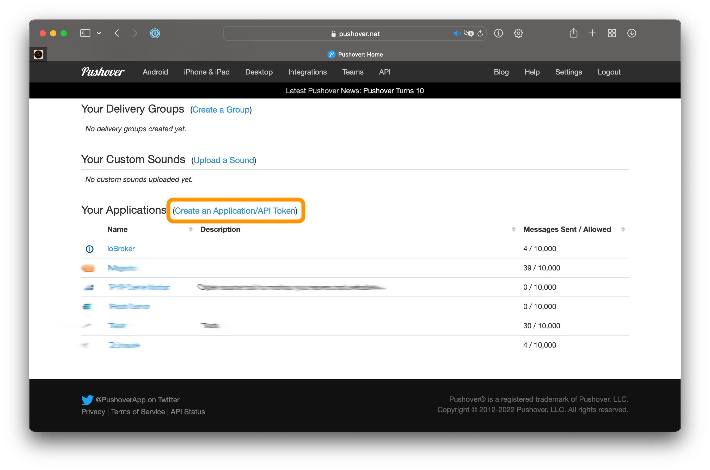

# ioBroker.pushover

## Configuration

1. Create a new account on [pushover.net](https://pushover.net/)
2. Create a new application
3. Configure the application token and user token in your pushover instance




## Usage

Send notification by using the JavaScript adapter:

```javascript
// send notification to all instances of pushover adapter
sendTo('pushover', 'message body');

// send notification to specific instance of pushover adapter
sendTo('pushover.1', 'message body');

// To specify subject or other options
sendTo('pushover', {
    message:  'Test text', // mandatory - your text message
    title:    'SweetHome', // optional  - your message's title, otherwise your app's name is used
    sound:    'magic',     // optional  - the name of one of the sounds supported by device clients to override the user's default sound choice
                           //    pushover, bike, bugle, cashregister, classical, cosmic, falling,
                           //    gamelan, incoming, intermission, magic, mechanical, pianobar, siren,
                           //    spacealarm, tugboat, alien, climb, persistent, echo, updown, none
    priority: -1,          // optional
                           //    -1 to always send as a quiet notification,
                           //    1 to display as high-priority and bypass the user's quiet hours, or
                           //    2 to also require confirmation from the user
    token: 'API/KEY token' // optional
                           // add other than configured token to the call  
    url,                   // optional  - a supplementary URL to show with your message
    url_title,             // optional  - a title for your supplementary URL, otherwise just the URL is shown
    device,                // optional  - your user's device name to send the message directly to that device, rather than all of the user's devices
    timestamp,             // optional  - a Unix timestamp of your message's date and time to display to the user, rather than the time your message is received by our API
    html,                  // optional  - 1 to enable parsing of HTML formatting for bold, italic, underlined and font color
    monospace,             // optional  - 1 to display the message in monospace font
                           //    either html or monospace is allowed
    file:                  '/opt/picture.png', // optional - attachment 
    file:                  { name: '/opt/picture.png', data: fs.readFileSync('/opt/picture.png') }, // optional - attachment 
});

// Example for HTML format in the message
sendTo('pushover', {
    message: 'This message includes <b>bold</b>, <i>italic</i> and <u>underlined</u> text <font color=green>in</font> <font color=#ffa500>different</font> <font color=red>colors</font>.',
    html: 1
});

// Example for monospace font in the message
sendTo('pushover', {
    message: 'This message is in monospace font.',
    monospace: 1
});
```

## Glances

With Pushover's Glances, you can push small bits of data directly to a constantly-updated screen, 
referred to as a widget, such as a complication on your smartwatch or a widget on your phone's lock screen.

```javascript
sendTo('pushover', 'glances', {
    message:  'Test text',    // mandatory - (100 characters) - the main line of data, used on most screens
    title:    'SweetHome',    // optional  - (100 characters) - a description of the data being shown, such as "Widgets Sold"
    token:    'API/KEY token' // optional  - add other than configured token to the call  
    subtext:  'Second line',  // optional  - (100 characters) - a second line of data
    count:    3,              // optional  - (integer, may be negative) - shown on smaller screens; useful for simple counts
    percent:  90,             // optional  - (integer 0 through 100, inclusive) - shown on some screens as a progress bar/circle
    device:   'DEVICE_NAME',  // optional  - a user's device name to restrict messages to the widget on that device, otherwise leave blank to send messages to all available widgets of that user
});
```

## Changelog

<!--
	Placeholder for the next version (at the beginning of the line):
	### __WORK IN PROGRESS__
-->

### 3.0.3 (2022-07-27)
* (Apollon77) Fix crash cases reported by Sentry

### 3.0.2 (2022-07-14)
* (bluefox) Added log output of sent messages
* (bluefox) Added custom sound to blockly

### 3.0.0 (2022-07-05)
* (klein0r) Added app limits as states
* (klein0r) Changed to class definition
* (klein0r) Updated logo
* (klein0r) Updated testing

### 2.1.0 (2022-02-20)
* Important: js-controller 3.0+ required! 
* (Apollon77) Remove some legacy code
* (Apollon77) Prevent potential crash case when error occurs

### 2.0.5 (2021-06-29)
* (bluefox) Corrected error with token

## License

The MIT License (MIT)

Copyright (c) 2014-2022 bluefox <dogafox@gmail.com>

Permission is hereby granted, free of charge, to any person obtaining a copy
of this software and associated documentation files (the "Software"), to deal
in the Software without restriction, including without limitation the rights
to use, copy, modify, merge, publish, distribute, sublicense, and/or sell
copies of the Software, and to permit persons to whom the Software is
furnished to do so, subject to the following conditions:

The above copyright notice and this permission notice shall be included in
all copies or substantial portions of the Software.

THE SOFTWARE IS PROVIDED "AS IS", WITHOUT WARRANTY OF ANY KIND, EXPRESS OR
IMPLIED, INCLUDING BUT NOT LIMITED TO THE WARRANTIES OF MERCHANTABILITY,
FITNESS FOR A PARTICULAR PURPOSE AND NONINFRINGEMENT. IN NO EVENT SHALL THE
AUTHORS OR COPYRIGHT HOLDERS BE LIABLE FOR ANY CLAIM, DAMAGES OR OTHER
LIABILITY, WHETHER IN AN ACTION OF CONTRACT, TORT OR OTHERWISE, ARISING FROM,
OUT OF OR IN CONNECTION WITH THE SOFTWARE OR THE USE OR OTHER DEALINGS IN
THE SOFTWARE.