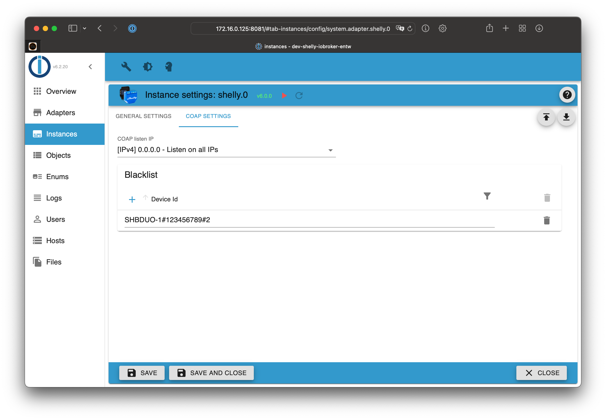

# ioBroker.shelly

## CoAP

By default, the CoAP protocol is used.

If you use the Shelly with firmware less equal 1.9.4 you don't have to configure anything. Your Shelly devices will be found by it self by ioBroker.

**If you are using the firmware versions above 1.9.4 you have to enter a CoIoT server for CoAP on your Shelly device.** Enter the IP address of your ioBroker server followed by the port ```5683``` as CoIoT server. For example, if ioBroker runs on address ```192.168.1.2```, you have to enter ```192.168.1.2:5683``` and activate CoIoT.

**Important: Because CoAP use multicast UDP packages, the Shelly devices has to be in the same subnet as your ioBroker server.**

If you use ioBroker in a docker container, the container has to run in network mode ```host``` or ```macvlan```. If the docker container is running in ```bridge``` mode, your Shelly devices will not be found.


CoAP will add all devices in your network. If you want to exclude some Shelly devices, you can put them on a blacklist. Just enter the serial numbers to the blacklist table:




### Important notes

#### Shelly Firmware 1.8.0 (or later)

- If you use the CoAP protocol, you have to use adapter version 4.0.0 or above.
- If you use devices with firmware below 1.8.0 (except Shelly 4 Pro) you have have to use adapter version 3.3.6 or below. The adapter version 4.0.0 (or later) would not work in this case!

#### Shelly Firmware 1.9.4 (or later)

- You have to enter a CoIoT server for CoAP. For more information, see CoAp section in this documentation.

### Trouble Shooting

In some cases, Shelly devices will not be found by the Shelly adapter in CoAP mode. Please try the following:

1. Disable the ioBroker Shelly adapter instance. **Do not uninstall the Shelly Adapter!** But it is important to disable the Shelly instance.
2. Open a terminal window and run following commands on the ioBroker server:

```
cd /opt/iobroker/node_modules/iobroker.shelly/
node coaptest.js 
```

You can use ```tcpdump``` for sniffing the CoAP Messages:

```
# Install tcpdump if it is not installed
sudo apt-get update
sudo apt-get install tcpdump

# tcpdump with IP address of Shelly device on network device eth1
sudo tcpdump -i eth1 src <IP-OF-SHELLY> and port 5683 -A   

# tcpdump with IP address of Shelly device 
sudo tcpdump src <IP-OF-SHELLY> and port 5683 -A

# tcpdump of all Shelly devices on network device eth1
sudo tcpdump  -i eth1 port 5683 -A

 # tcpdump of all Shelly devices
sudo tcpdump port 5683 -A
```

Now you shall see all CoAP messages from the Shelly. If you don't see any messages, you have a network problem with UDP or multicast messages.  

CoAP Messages look like that:

``` 
UDP Server listening on 0.0.0.0:5683
2020-08-19T19:33:29.484Z - 192.168.20.233:5683 - P-B3citsml	SHBTN-1#AXXXXXXXXXX#2RC{"G":[[0,9103,0],[0,2102,"S"],[0,2103,1],[0,3115,0],[0,3112,0],[0,3111,100],[0,9102,["button"]]]}
2020-08-19T19:33:29.827Z - 192.168.20.233:5683 - P-C3citsml	SHBTN-1#AXXXXXXXXXX#2RC{"G":[[0,9103,0],[0,2102,"S"],[0,2103,1],[0,3115,0],[0,3112,0],[0,3111,100],[0,9102,["button"]]]}
2020-08-19T19:33:33.942Z - 192.168.20.233:5683 - P-D3citsml	SHBTN-1#AXXXXXXXXXX#2RC{"G":[[0,9103,0],[0,2102,"S"],[0,2103,1],[0,3115,0],[0,3112,0],[0,3111,100],[0,9102,["button"]]]}
```