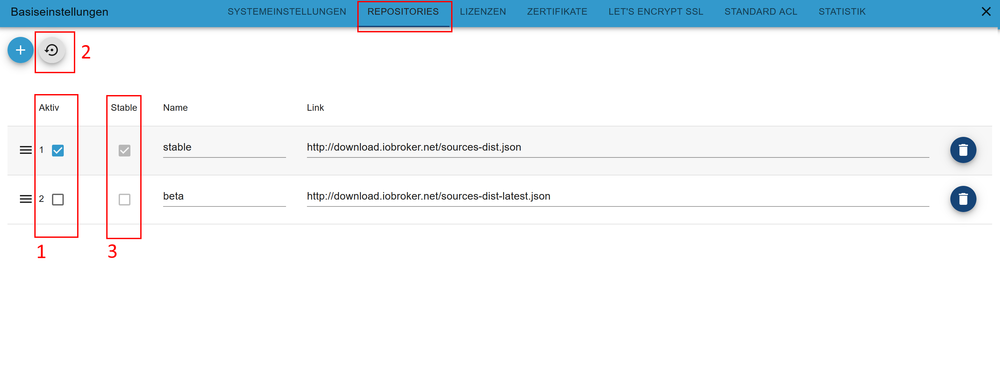

A repository is a central repository for software programs.

The adapters, which can be displayed and installed/updated via the ioBroker admin interface, are managed via a central repository (a repository).
By default, ioBroker is configured after installation so that the "stable" repository is accessed and the adapters stored there are offered for installation.

There are two repositories available in ioBroker:

- **stable**: In this repository, the adapters are available in the version that has already been tested and can therefore be used on a production system
- **beta**: The adapter versions are available in this repository, which are currently in the test phase (!) and may still contain several errors. The beta repository used to be called latest, since the purpose of the name was not really clear, it was renamed from latest to beta.

?> Basically, the stable repository should ***ALWAYS*** be used for a productive installation of ioBroker. The beta repository contains versions that still contain errors and may affect the entire system.

## Repository selection
Open the basic settings in the system settings using the open-end wrench:

The desired repository can be selected in the Repositories tab:

The default paths of the stable and beta repositories are:

- stable - link to repository http://download.iobroker.net/sources-dist.json
- beta - Link to repository http://download.iobroker.net/sources-dist-latest.json

If the beta repository was selected, a corresponding warning appears in the adapter overview:

## What should I do if I ever need an adapter from the beta repository?
In the past, this meant switching the repository from stable to beta in ioBroker, installing one adapter and then switching back. The latter usually fell by the wayside.

Since Admin 5, this is much more convenient WITHOUT having to change the repository!

- Activate expert mode
- In the "Adapter" menu, go to the "Install from your own URL" (GitHub) button and switch to the first tab "From NPM".
- In the "Select adapter" field, the desired adapter can now be entered / selected, which is to be installed

This way one can install the latest beta version without having to switch their repository.

## How does an adapter get into the beta or stable repository?
Long before an adapter is ready to be installed in ioBroker via the admin interface, a developer submits a request for inclusion in the repository. When that happens, experienced developers look at the new adapter source code and give the requesting developer feedback on the items that need to be processed before the new adapter can be included in the repository.

A new adapter is first available in the beta repository and can then be extensively tested by the (beta) testers. When the test phase is completed and the reported bugs have been fixed, the version of the adapter will be made available in the stable repository.

After a function change to the adapter, this is normally only made available again in the beta repository for testing until the version is released for the stable repository after the test phase has ended.