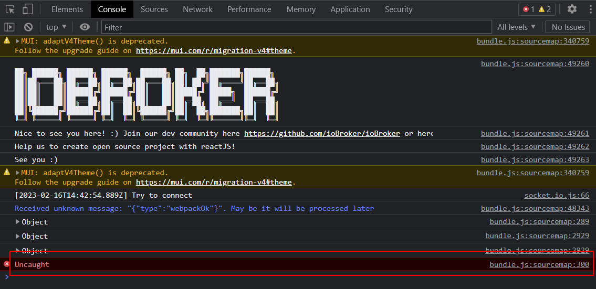

## Report errors in the graphical user interface
ioBroker has many graphical interfaces written with JavaScript.

Many interfaces are currently being developed with ReactJS.
If an error occurs in such an interface, or the response freezes, or the site behaves unexpectedly, then you can and should report the error.

For this you have to open the browser console and find the error messages there.
The browser console is different in each browser, but most browsers have the console in the developer view and the developer view is usually accessible with F12 (Chrome, Firefox, Edge).

It is important to **open the browser console first, then reload the page (F5)* and then take the actions that are causing the error.

This is what the browser console looks like in Chrome: 

This is what an error message looks like if the console opens after the page has loaded: 

And like this, if the console is opened before the page loads: 

As you could notice, it shows the file name and line number where the error occurs.

With this information (along with the version number of the adapter) we can reproduce or fix the bug.