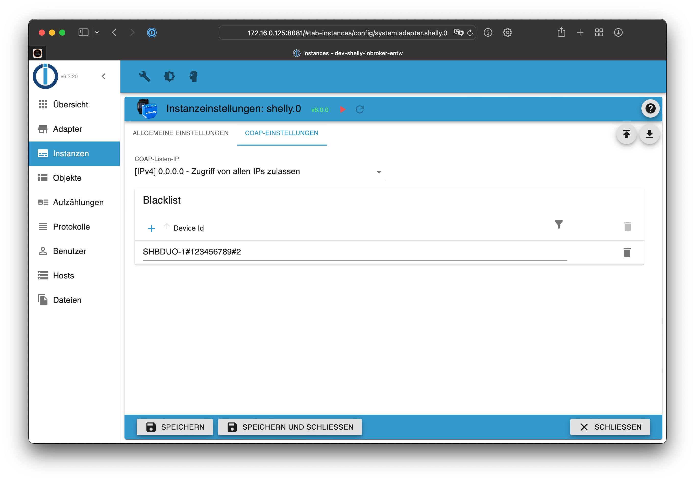

# IoBroker.шелли
## КоАП
Протокол CoAP используется по умолчанию.

Если вы используете Shelly с прошивкой ниже или равной 1.9.4, дальнейшая настройка не требуется. Ваши устройства будут найдены адаптером автоматически.

**Если вы используете версию выше 1.9.4, вам необходимо настроить сервер CoIoT для CoAP на устройствах Shelly.** Введите IP-адрес вашего сервера ioBroker в качестве сервера CoIoT, а затем порт §§ YYYYY_0§§. Например, если ваш ioBroker доступен по адресу ```192.168.1.2```, введите ```192.168.1.2:5683``` и активируйте CoIoT.

**Важно: поскольку CoAP использует многоадресные пакеты UDP, ваши устройства Shelly должны находиться в той же подсети, что и ваш сервер ioBroker.**

Если вы используете ioBroker в контейнере Docker, контейнер должен быть настроен в сетевом режиме §§ГГГГ_0§§ или §§ГГГГГ_1§§. Если контейнер Docker работает в сетевом режиме ```bridge```, устройства Shelly не будут найдены.


CoAP добавляет все устройства в вашей сети. Если вы хотите исключить отдельные устройства, вы можете настроить их в черный список. Для этого введите серийные номера в таблицу:




### Важные инструкции
#### Прошивка Shelly 1.8.0 (или новее)
- Если вы используете протокол CoAP, начиная с этой версии необходимо использовать адаптер версии 4.0.0 (или новее).
- Для устройств с более старой прошивкой (кроме Shelly 4 Pro) необходимо использовать адаптер версии 3.3.6 (или старше). Адаптер версии 4.0.0 (или новее) не совместим со старыми версиями прошивки!

#### Прошивка Shelly 1.9.4 (или новее)
- Начиная с этой версии сервер CoIoT должен храниться на каждом Shelly, если используется протокол CoAP. Дополнительные сведения см. в разделе CoAP в этой документации.

### Поиск проблемы
В некоторых случаях адаптер Shelly может не найти все устройства в режиме CoAP. Затем попробуйте следующее:

1. Остановите свой экземпляр адаптера Shelly. **Не нужно удалять адаптер!**
2. Откройте окно терминала и выполните следующие команды на сервере ioBroker:

```
cd /opt/iobroker/node_modules/iobroker.shelly/
node coaptest.js
```

В качестве альтернативы можно использовать ```tcpdump```:

```
# Install tcpdump if it is not installed
sudo apt-get update
sudo apt-get install tcpdump

# tcpdump with IP address of Shelly device on network device eth1
sudo tcpdump -i eth1 src <IP-OF-SHELLY> and port 5683 -A

# tcpdump with IP address of Shelly device
sudo tcpdump src <IP-OF-SHELLY> and port 5683 -A

# tcpdump of all Shelly devices on network device eth1
sudo tcpdump  -i eth1 port 5683 -A

 # tcpdump of all Shelly devices
sudo tcpdump port 5683 -A
```

Теперь вы должны увидеть все сообщения CoAP от устройств Shelly. Если вы не видите никаких сообщений, у вас есть сетевая проблема с UDP или многоадресными сообщениями.

Сообщения CoAP выглядят так:

``` 
UDP Server listening on 0.0.0.0:5683
2020-08-19T19:33:29.484Z - 192.168.20.233:5683 - P-B3citsml	SHBTN-1#AXXXXXXXXXX#2RC{"G":[[0,9103,0],[0,2102,"S"],[0,2103,1],[0,3115,0],[0,3112,0],[0,3111,100],[0,9102,["button"]]]}
2020-08-19T19:33:29.827Z - 192.168.20.233:5683 - P-C3citsml	SHBTN-1#AXXXXXXXXXX#2RC{"G":[[0,9103,0],[0,2102,"S"],[0,2103,1],[0,3115,0],[0,3112,0],[0,3111,100],[0,9102,["button"]]]}
2020-08-19T19:33:33.942Z - 192.168.20.233:5683 - P-D3citsml	SHBTN-1#AXXXXXXXXXX#2RC{"G":[[0,9103,0],[0,2102,"S"],[0,2103,1],[0,3115,0],[0,3112,0],[0,3111,100],[0,9102,["button"]]]}
```