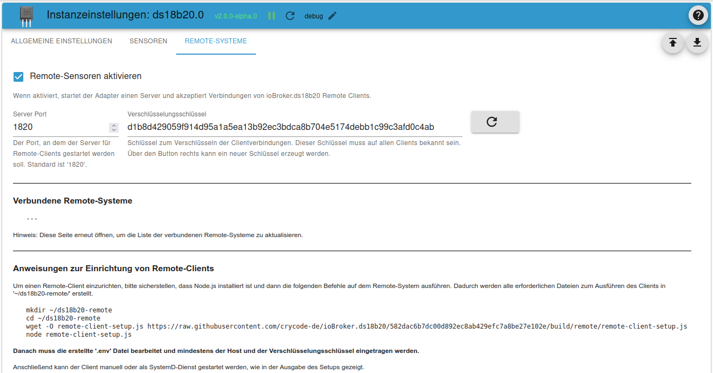

# IoBroker.ds18b20
适配器`ds18b20`可将 DS18B20 或类似类型的 1-Wire 温度传感器直接集成到 ioBroker 中。

需要支持 1-Wire 总线的适当硬件（例如 Raspberry Pi），并且必须设置 1-Wire 总线才能在系统上工作（`/sys/bus/w1/devices/` 下列出的传感器）。

下面是一个将 DS18B20 传感器连接到 Raspberry Pi 的示例。

＃＃ 特征
* 读取当前温度值
* 自动检测连接的传感器
* 查询传感器时的错误检测（校验和、通信错误、设备断开连接）
* 每个传感器的轮询间隔可调
* 可以禁用单个传感器
* 每个传感器测量值的舍入和转换可调
* 通过_远程客户端_支持远程系统上的传感器

＃＃ 安装
该适配器可从稳定的最新存储库中获取。

最新的开发版本也可以通过 GitHub URL `https://github.com/crycode-de/ioBroker.ds18b20.git` 安装。
但是，仅在极少数情况下才建议这样做！

＃＃ 配置
在适配器配置中，可以为所有传感器设置**默认轮询间隔**（以毫秒为单位）。最低为 500。

此外，如果需要，可以调整 **1-Wire 器件的路径**。
这里的标准是`/sys/bus/w1/devices`，这意味着找到所有现有总线主控的传感器。
或者，可以指定到总线主控器的直接路径，例如`/sys/bus/w1/devices/w1_bus_master1`，从而仅找到该总线主控器的传感器。


可以手动或通过**搜索传感器**将各个传感器添加到表中。


**地址** 是传感器的 1-Wire 地址/ID，同时确定对象 ID。
例如，地址为 `28-0000077ba131` 的传感器获取对象 ID `ds18b20.0.sensors.28-0000077ba131`。

对于直接连接的传感器，**远程系统 ID** 未设置（空）；对于远程系统上的传感器，则设置相应系统的 ID。

可以自由选择**名称**来识别传感器。

可以为每个传感器指定额外的**查询间隔**（以毫秒为单位）。
如果该字段留空，则应用标准轮询间隔。最低为 500。

**单位** 确定 ioBroker 对象中存储的值的单位。
默认情况下，这是`°C`。

通过**因子**和**偏移**，可以根据公式`Wert = (Wert * Faktor) + Offset`调整传感器读取的值。

**小数位**表示该值四舍五入到多少个小数位。
在使用因子和偏移量计算之后进行舍入。

**错误归零**定义了读取传感器时如何处理错误。
如果设置了该选项，则在发生错误时会将`null`值写入传感器状态。
如果没有此选项，出现错误时状态不会更新。

可以通过**激活**复选标记单独停用各个传感器。

为了将传感器集成到远程系统中，还可以激活和配置为此目的集成的服务器。



加密密钥必须传送到所有远程系统。这对服务器和客户端之间的通信进行加密。

### 从 `°C` 转换为 `°F`
为了使适配器在`°F`中返回测量温度，必须使用`1.8`作为因子，并使用`32`作为偏移量。

## 行动
通过写入`ds18b20.0.actions.readNow`状态，可以触发对所有或特定传感器的立即读取。

为了触发所有传感器的立即读取，必须在状态中写入关键字`all`。

如果只读取特定传感器，则必须将传感器的地址或 ioBroker 对象 ID 写入状态。

## 在脚本中使用
可以向适配器发送命令以读取传感器数据或搜索传感器。

### `read` / `readNow`
使用`read`或`readNow`命令，可以读取所有传感器或单个传感器。

如果查询所有传感器，则响应包含一个对象，其中包含当前值的传感器地址。

为了读取单个传感器，必须将要读取的传感器的地址或 ioBroker 对象 ID 指定为消息部分。
在这种情况下，直接返回该值。

```js
sendTo('ds18b20.0', 'read', null, (ret) => {
    log('ret: ' + JSON.stringify(ret));
    // ret: {"err":null,"value":{"28-0000077b9fea":21.94}}

    if (ret.err) {
        log(ret.err, 'warn');
    }
});

sendTo('ds18b20.0', 'read', '28-0000077ba131', (ret) => {
    log('ret: ' + JSON.stringify(ret));
    // ret: {"err":null,"value":21.94}

    if (ret.err) {
        log(ret.err, 'warn');
    }
});
```

### `search`
`search` 命令搜索当前连接的 1-Wire 传感器，并通过回调函数返回找到的传感器的地址。

```js
sendTo('ds18b20.0', 'search', {}, (ret) => {
    log('ret: ' + JSON.stringify(ret));
    if (ret.err) {
        log(ret.err, 'warn');
    } else {
        for (let s of ret.sensors) {
            if (s.remoteSystemId) {
                log('Sensor: ' + s.address + '@' + s.remoteSystemId);
            } else {
                log('Sensor: ' + s.address);
            }
        }
    }
});
```

### `getRemoteSystems`
可以通过`getRemoteSystems`查询当前连接的远程系统的系统ID。

```js
sendTo('ds18b20.0', 'getRemoteSystems', {}, (ret) => {
    log('ret: ' + JSON.stringify(ret));
    log('Verbundene Systeme: ' + ret.join(', '));
});
```

## 适配器信息
每个适配器实例通过`ds18b20.*.info.connection`状态提供关于所有配置的传感器是否正在提供数据的信息。
如果所有传感器的最后一次读取均成功，则此状态为`true`。
一旦其中一个传感器显示错误，该状态即为`false`。
如果启用了远程传感器并且远程服务器出现问题，此状态也将是`false`。

如果激活远程系统，则可以在状态`ds18b20.*.info.remotesConnected`中找到当前连接的远程系统的列表。

## Raspberry Pi 上的 DS18B20
DS18B20 温度传感器连接到 Raspberry Pi，如下图所示。
请注意，上拉电阻必须连接到+3.3V，而不是+5V，因为这会损坏GPIO。
本例中使用 GPIO.04 (BCM)。


要激活 Raspberry Pi 上的 1-Wire 总线，必须将以下行添加到 `/boot/config.txt` 文件中，然后必须重新启动 Raspberry Pi。

```text
dtoverlay=w1-gpio,gpiopin=4
```

如果一切正常，连接的传感器将在`/sys/bus/w1/devices/`下可见。

```sh
$ ls -l /sys/bus/w1/devices/
insgesamt 0
lrwxrwxrwx 1 root root 0 Nov  2 11:18 28-0000077b4592 -> ../../../devices/w1_bus_master1/28-0000077b4592
lrwxrwxrwx 1 root root 0 Nov  2 11:18 28-0000077b9fea -> ../../../devices/w1_bus_master1/28-0000077b9fea
lrwxrwxrwx 1 root root 0 Nov  2 10:49 w1_bus_master1 -> ../../../devices/w1_bus_master1
```

### 在 Raspberry Pi 上使用许多传感器
Raspberry Pi 上一条线路上可以无差错运行的传感器数量是有限的，并且取决于某些技术条件（例如电缆长度）。
第一次故障（有时是随机故障）通常发生在 10 个左右的传感器上。

为了能够操作更多传感器，可以将它们分成几股（即几个 GPIO）。
每条线都需要自己的上拉电阻。

要激活它，只需将几个具有相应 GPIO 编号的条目添加到 `/boot/config.txt` 文件中即可：

```text
dtoverlay=w1-gpio,gpiopin=4
dtoverlay=w1-gpio,gpiopin=17
```

然后，每个条目在系统中生成自己的`w1_bus_masterX`。

### 负温度下的内核错误
例如，在 Raspberry Pi 的 5.10.y 内核中，自 2020 年 11 月中旬以来存在一个错误，读取负温度为 4092 °C。 （请参阅[GitHub问题](https://github.com/raspberrypi/linux/issues/4124)）此错误已于 2021 年 2 月 8 日在内核 5.10.14 中修复。 （参见[GitHub 提交](https://github.com/Hexxeh/rpi-firmware/commit/115e3a5f77488d9ee30a33bcb5ac31eb587f60a8)）`rpi-update`应该可以解决这个问题。

对于 v1.2.2 及之前的适配器版本，这些明显不正确的值将被传输到 ioBroker 状态。
从 v1.2.3 开始，适配器还会检查读取值是否合理（-80 至 +150 °C 之间）并丢弃不合理的值。

## 将传感器集成到远程系统中
从_ioBroker.ds18b20_版本1.4.0开始，远程系统上的传感器可以通过您自己的_ioBroker.ds18b20远程客户端_直接集成。这仅需要远程系统上的 Node.js。

**启用远程传感器** 必须在适配器配置中选中。然后适配器在指定端口上启动 TCP 服务器并接受来自客户端的连接。

服务器和客户端之间的连接使用`aes-256-cbc`算法进行加密。
为此，必须在客户端上设置适配器配置中显示的加密密钥。

然后，_ioBroker.ds18b20 远程客户端_ 建立到适配器的 TCP 连接，并显示在适配器配置中的 **已连接的远程系统** 下。

### IoBroker.ds18b20 远程客户端的安装
_ioBroker.ds18b20 远程客户端_的设置通过 GitHub 提供。

请参阅适配器配置以获取设置说明。

## Changelog

<!--
    Placeholder for the next version (at the beginning of the line):
    ### **WORK IN PROGRESS**
-->
### 2.0.2 (2023-07-23)

* (crycode-de) Fixed bug on sensor migration
* (crycode-de) 💥 Need to set a new remote encryption key in admin if remote sensors are used

### 2.0.1 (2023-07-19)

* (crycode-de) Fixed config migration
* (crycode-de) Added warning message for upgrades

### 2.0.0 (2023-07-19)

* (crycode-de) 💥 Node.js 16.4+, js-controller 4+ and admin 6+ are required
* (crycode-de) New Admin UI using JsonConfig
* (crycode-de) 💥 `read` and `readNow` actions are now merged
* (crycode-de) New state `info.remotesConnected` with a list of connected remote systems (if enabled)
* (crycode-de) Added icons for the sensor status to the sensor objects
* (crycode-de) Label objects of disabled sensors
* (crycode-de) Delete objects of unconfigured/deleted sensors
* (crycode-de) Updated translations
* (crycode-de) Code optimizations and upgrades to current standards
* (crycode-de) Updated dependencies

### 1.6.1 (2022-12-15)

* (crycode-de) Remote client setup url displayed in admin UI fixed

### 1.6.0 (2022-01-29)

* (crycode-de) Added sorting of sensors in admin and keep the sort order
* (crycode-de) Allow usage of w1_bus_masterX directly as w1DevicesPath
* (crycode-de) Fixed display of errors in admin

## License

Copyright (c) 2019-2023 Peter Müller <peter@crycode.de>

### MIT License

Permission is hereby granted, free of charge, to any person obtaining
a copy of this software and associated documentation files (the
"Software"), to deal in the Software without restriction, including
without limitation the rights to use, copy, modify, merge, publish,
distribute, sublicense, and/or sell copies of the Software, and to
permit persons to whom the Software is furnished to do so, subject to
the following conditions:

The above copyright notice and this permission notice shall be
included in all copies or substantial portions of the Software.

THE SOFTWARE IS PROVIDED "AS IS", WITHOUT WARRANTY OF ANY KIND,
EXPRESS OR IMPLIED, INCLUDING BUT NOT LIMITED TO THE WARRANTIES OF
MERCHANTABILITY, FITNESS FOR A PARTICULAR PURPOSE AND
NONINFRINGEMENT. IN NO EVENT SHALL THE AUTHORS OR COPYRIGHT HOLDERS BE
LIABLE FOR ANY CLAIM, DAMAGES OR OTHER LIABILITY, WHETHER IN AN ACTION
OF CONTRACT, TORT OR OTHERWISE, ARISING FROM, OUT OF OR IN CONNECTION
WITH THE SOFTWARE OR THE USE OR OTHER DEALINGS IN THE SOFTWARE.