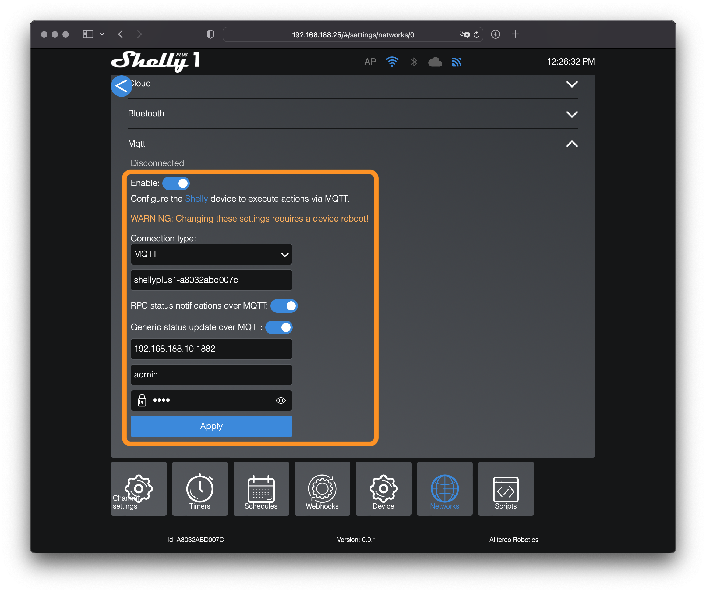

# IoBroker.shelly
这是德语文档 - [🇺🇸英文版](../en/protocol-mqtt.md)

## MQTT

### 重要说明
- 无法将 Shelly 适配器连接到现有 MQTT 代理
- Shelly 适配器启动自己的 MQTT 代理，该代理在端口“1882”上启动，以避免与同一系统上的其他 MQTT 代理发生冲突（MQTT 的默认端口为“1883”）
- 无法将 MQTT 客户端（例如 MQTT Explorer）连接到内部 MQTT 代理
- 内部MQTT代理的默认端口可以在适配器的配置中调整
- **无需了解 MQTT 协议** - 所有通信均在内部处理

问题？首先看[常问问题](faq.md)！

＃＃＃ 配置
1.在ioBroker中打开Shelly适配器配置
2. 在*常规设置*中选择“MQTT（和 HTTP）”作为*协议*
3. 打开 **MQTT 设置** 选项卡
4. 选择一个用户名和一个强密码（您必须将此信息存储在所有 Shelly 设备上）

> Shelly 适配器启动其自己的 MQTT 代理（内部）。配置的用户名和密码必须存储在要连接到该代理的所有 Shelly 设备上。

在您的 Shelly 设备上启用 MQTT。

### 第 2 代设备（Plus 和 Pro）
1. 在浏览器中打开 Shelly Web 配置（不是在 Shelly 应用程序中！）
2. 转到“网络 -> Mqtt”
3. 激活 MQTT 并输入刚刚配置的用户数据和安装 ioBroker 的系统的 IP 地址 - 后跟配置的端口（例如“192.168.1.2:1882”）
4.保存配置-Shelly会自动重启

- **不要更改此配置中的“客户端 ID”**
- **对于第 2 代设备 (Gen2)，必须激活所有 RPC 选项（参见屏幕截图）！**
- 不得激活 SSL/TLS

### 第一代设备
1. 在浏览器中打开 Shelly Web 配置（不是在 Shelly 应用程序中！）
2. 转到“互联网和安全设置 -> 高级 - 开发人员设置”
3. 激活 MQTT 并输入刚刚配置的用户数据和安装 ioBroker 的系统的 IP 地址 - 后跟配置的端口（例如“192.168.1.2:1882”）
4.保存配置-Shelly会自动重启

### 服务质量 (QoS)
TODO（参见 en）