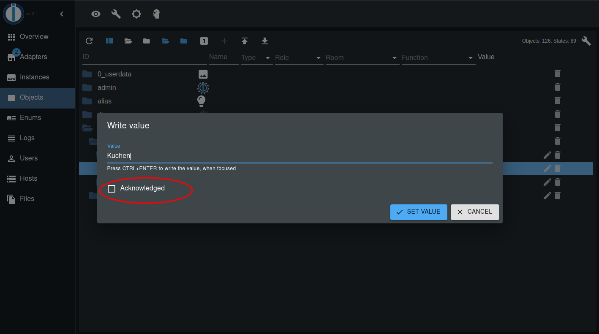

#用于 ioBroker 的 Synology-Chat 适配器

[![捐赠][捐赠徽章2]][捐赠链接]

＃＃ 它是什么？
此适配器提供 Synology Chat 和 ioBroker 之间的接口。\ 为此，使用了 Synology Chat 提供的标准集成功能和相应的 REST API 端点。
传入和传出集成可用于将消息发送到 Synology 聊天服务器或更新 ioBroker 实例中的消息对象以接收消息。

---

＃ 手动的
## 1. 安装
可以从 ioBroker 安装中的适配器部分实例化适配器。
更多信息可以在官方[ioBroker 文档](https://www.iobroker.net/#de/documentation/admin/adapter.md)中找到。

## 2. 配置

### 2.1。 Synology 聊天配置
- Synology Chat 提供了处理传入和传出消息的可能性。在下文中，将更详细地检查这两个选项。

- 要通过 Synology Chat 界面创建消息，必须在 Synology Chat 中创建集成：

  #### 2.1.1。传入集成
要在 Synology 聊天中集成传入消息，需要一个令牌，该令牌可以从创建期间生成的 URL 中获取。

  #### 2.1.1。传出集成
要在 Synology 聊天中集成传出消息，需要提供网络挂钩 URL。在实例化 `synochat` 适配器后，您将从实例对象中获取此 Web 挂钩 URL。更多细节可以在[3. 用法 > 3.1 一般](#webHookLocation)中找到

***注意：*** *频道类型（传入；传出）是从 Synology 聊天的角度指定的。例如，“传入”表示消息将发送到 Synology 聊天服务器。*

有关如何在 Synology 聊天中处理集成的更多详细信息，请参阅 Synology 的官方文档[这里](https://kb.synology.com/DSM/help/Chat/chat_integration)

### 2.2。 ioBroker 适配器实例配置
- 此适配器的配置可以在实例设置中完成。

    #### 2.2.1。主要设置：
	

* **Synology URL/IP**

使用此属性，将提供您的 Synology-Chat 应用程序的 URL。请注意使用包含 `http://` 或 `https://` 的绝对 URL，并且不要提供像 `/` 这样的后缀。
可以使用 `:` 在 URL 后面照常提供特定端口。

***有效值示例：***

- https://mychat.mydomain.tld
- https://192.168.1.1:8080

    * **验证 SSL 证书**

当然，始终建议对数据传输进行加密。
通常，自签名证书用于家庭环境中的加密连接。在这种情况下，可能需要禁用 HTTP 连接的 SSL 证书验证。
禁用此属性以关闭证书验证。

* **ioBroker 实例的主机名/IP 地址**

        此属性允许您指定可通过 URL 访问 ioBroker 实例的主机名或 IP 地址。在初始适配器实例化后，此值会自动设置为 ioBroker 安装的主机操作系统的当前 IP 地址。

如果使用 ioBroker 作为 Docker 实例，可能需要更改此值，例如如果使用反向代理或类似代理来访问您的 ioBroker 实例。

此值用于为从 Synology 聊天服务器接收消息的频道生成 Web 挂钩 URL。

* **从 Synology 聊天发送到 ioBroker 适配器实例的消息的 Web 实例**

        `synochat` 适配器正在使用 `web` 适配器来提供网络挂钩。您需要选择 `web` 适配器的特定实例，以便为 Synology 聊天集成提供专用网络挂钩。

    #### 2.2.2。频道配置/管理：
	

* **频道已启用**

此选项可用于禁用传入或传出消息的处理。

这可能很有用，例如用户只想暂时禁用通道的使用，并希望保留访问令牌或类似设置以防止再次收集它们。

    * **频道名称**

此设置指定发送消息的通道名称。该名称可以自由选择，用于引用。

要在此处配置的频道名称应与 Synology 聊天的频道名称相同。

* **频道令牌**

此设置提供 Synology 聊天频道的访问令牌。根据通道类型的不同，它的创建会有所不同。
更多细节可以在章节[Synology 聊天配置](#synology-chat-configuration)中找到。

***注意：***\ *根据集成的不同，创建 Synology 聊天集成时，您将获得类似于以下示例的链接：*

https://mychat.mydomain.tld/webapi/entry.cgi?api=SYNO.Chat.External&method=incoming&version=2&token=%22QF5DWyG7M47Ls3cv%22

*在此示例中，令牌包含在 URL 中。编码控制字符 - `%22` - 在设置的开头和结尾指定。\ **必须删除这些字符！**\ 在此示例中，要输入的标记为 `QF5DWyG7M47Ls3cv`。 *

* **频道类型**

***注意：***\ *必须从 Synology 聊天的角度指定频道类型。例如，在配置中选择“传入”意味着消息将发送到 Synology 聊天室。*

此设置指定将使用的 Synology 聊天频道类型，具体取决于在 Synology 聊天中选择的集成。

* **将数据发送到 Synology 聊天服务器 - 传入集成**\

此选项使通道能够在对象值更改时立即发送 ioBroker 消息对象（[见使用章节](#usage)）的新值。

        * **从 Synology 聊天服务器获取数据 - 传出集成**\

此选项使通道能够从 Synology 聊天服务器接收消息并更新 ioBroker 消息对象的新值 ([见使用章节](#usage))。

请注意，使用此频道类型时，ioBroker 适配器实例配置的频道名称必须与 Synology 聊天频道的频道名称相同，才能接收消息。

如果应该在发送和接收消息中都配置一个通道，只需添加一个具有相同名称的通道并选择另一个通道类型。

* **验证 SSL 证书 - 对于非文本消息**

如果对于传入通道类型，要发送文本以外的内容，例如图像，则通过 URL 从 HTTP 源指定。如果此内容提供自签名证书，则可以使用此设置启用或禁用证书检查。
有关发送非文本内容的详细信息，请参阅章节[Synology 聊天配置](#synology-chat-configuration).。

#### 2.2.3。帮助：
   * 此选项卡通常会重定向到该项目的官方 GitHub 页面，其中提供了详细的帮助和使用说明。
* 如果有任何未解决的问题、更改建议、不需要的行为或错误，请创建 [GitHub 问题](https://github.com/phoeluga/ioBroker.synochat/issues/new/choose) 以确保质量这个项目。

### 2.3。 `web`实例的配置
要从 Synology 聊天服务器接收消息，需要配置传出集成 - 请参阅 [传出集成](#synologyChatConfigurationOutgoingIntegration)。

这需要 `web` 适配器的实例正在运行并在 [`synochat` 适配器实例已配置](#configurationAdapterWebInstance) 中进行配置。

如果使用的 `web` 实例配置为通过 HTTPS 使用安全连接，**确保您提供有效的证书或将您自己的证书导入到 Synology 受信任的证书中**。\否则，不会从Synology 聊天服务器到您的 ioBroker 适配器实例。
将无法建立通信，不幸的是，两个站点上的用户都不会直接指示消息由于证书无效而被拒绝。

如果配置的 `web` 实例配置为通过 HTTPS 使用安全连接，请确保提供有效证书或将您自己的证书导入 Synology 中的受信任证书。
否则，不会有任何消息从 Synology 聊天服务器发送到您的 ioBroker 适配器实例。

## 3. 用法
### 3.1 一般
* 配置适配器实例后，会在相应适配器实例的对象中为每个配置的通道创建一个具有通道名称的文件夹。

	

* 在此文件夹中可以找到相应通道的消息对象，它代表发送或接收的消息。

***注意：***\ *发送消息或用户更改消息对象时，请确保未设置 Ack 标志。在 Synology 聊天服务器确认成功接收到消息后，适配器将设置 Ack 标志。*\ **如果用户在 ioBroker 对象视图中更改消息值时设置了 Ack 标志，则消息将不予处理！***

	

* 当消息对象更改并且频道类型设置为“将数据发送到 Synology 聊天服务器”时，此消息（取决于频道类型）将传递到 Synology 聊天。

	

* 网络挂钩 URL/地址将作为对象值提供在适配器实例的 info 文件夹中，并且对具有一个适配器实例的所有通道均有效。

	

### 3.2 消息内容类型
除了发送纯文本消息外，还可以将图像等其他内容类型发送到传入通道。\ 要实现这一点，内容必须可作为 Web 资源使用。要发送图像，只需将 URL 设置为 [3. 用法 > 3.1 一般](#usage) 中提到的 Syno-Chat 适配器实例的消息对象的值。

**监控摄像头用例示例：**\ 许多监控摄像头提供流或接口来检索在指定时间间隔或检测到运动时更新的图像。\ 此 URL 提供需要被设置为消息对象的值。

### 3.3 出现问题时进行调试
要在出现问题时获取有关适配器行为的更多详细信息，可以将 `synochat` 适配器实例的日志级别提高到 `debug`。

由于此适配器使用 `web` 适配器实例向 Synology 聊天服务器提供 Web 挂钩，因此配置的 `web` 实例正在执行一些功能。为了在收到消息问题的情况下获得更详细的信息，您需要将配置的`web`实例的日志级别也提高到`debug`。与`synochat`适配器相关的日志消息可以通过日志消息前缀`synochat.<INSTANCE_NUMBER>`来识别。

---

## 其他披露
#### 资源归属
- [Pixel perfect 创建的聊天图标 - Flaticon](https://www.flaticon.com/free-icons/chat)

[donate-badge]:https://img.shields.io/static/v1?label=Treat%20a%20coffee&message=donate%20a%20tip&color=2a9cde&logo=

[donate-badge2]:https://img.shields.io/static/v1?label=Treat%20a%20coffee&message=donate%20a%20tip&color=2a9cde&logo=

[donate-link]: https://www.paypal.com/donate/?hosted_button_id=9MLB29CKX5674

## Changelog
All changes to this project are described in the [CHANGELOG](./CHANGELOG.md).

## License

This code is licensed under 'The MIT License (MIT)' license specified in the [LICENSE](./LICENSE) file.

Copyright (c) 2022 phoeluga <phoeluga@gmail.com>