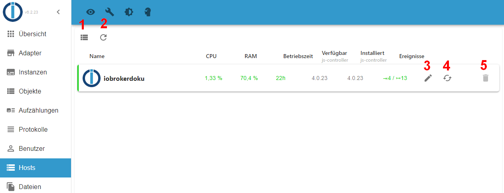

可用的主机在此处显示。

在标准系统中只有一个主机。在多主机系统中，有几个相应的。

## 标题行
标题栏包含最重要进程的图标。每个图标都有上下文帮助。只需将鼠标放在图标上一会儿。

详细图标：

### 1 - 切换视图
使用此按钮，您可以在磁贴和列表视图之间切换（切换功能）

### 2 - 获取更新
要检查 js-controller 是否有更新，您可以单击此按钮。如果有可用更新，菜单栏中的 ***Hosts*** 项中将显示与要更新的主机相对应的编号，并且新版本显示在可用下方的磁贴中。

### 3 - 过滤器
在此字段中，您可以根据自己的需要过滤主机列表

##页面内容
该页面列出了现有主机。

对于每个主机，都有一个磁贴（列表视图中的一行），其中显示了相应主机的数据。

以下图标用于管理主机：

### 4 - 编辑
可以在此处更改主机的名称。此名称必须是唯一的。

### 5 - 重启主机
对应的主机可以用这个按钮重启。单击它对应于重新启动命令。

### 6 - 删除主机
此按钮仅对从站可用。如果从多主机环境中删除了从属设备，则也可以删除属于该主机的所有对象。

### 7 - 控制器更新
如果设置存储库的 js 控制器有更新，则会出现另一个图标：

但是，与适配器的图标相反，单击此图标不会启动更新，因为为此必须关闭 ioBroker。相反，会出现有关如何进行的说明。