# 普罗克斯莫克斯

## Proxmox 安装
Proxmox虚拟环境（简称Proxmox VE）是一个基于Debian的虚拟化平台。 Proxmox 的虚拟化技术基于 QEMU/KVM。

Proxmox 将 QEMU/KVM“打包”在自己的 Web 界面中，从而使管理变得非常容易（并且还支持 Linux 容器 - LXC）。这使得 Proxmox 一方面对初学者友好，但另一方面又如此强大，以至于它也可以在专业环境中使用。

本节展示免费版本（非订阅）Proxmox 的安装和基本配置示例。

为了清楚起见，可以打开图像描述和附加信息。

＃＃＃ 要求

要求

- 64位CPU
- CPU和主板必须支持Intel VT/AMD-V虚拟化并在BIOS中激活。
- 1 GB RAM（仅适用于 Proxmox） - 根据要操作的虚拟机数量，这里当然需要更多 RAM。因此，建议至少使用 8 GB、最好是 16 GB RAM。

</详情>

### 创建 ISO 映像/可启动 USB 记忆棒
首先，您需要一个 ISO 映像，可以从 [Proxmox下载页面](https://www.proxmox.com/de/downloads/category/iso-images-pve) 下载。

Proxmox 异

</详情>

安装时，必须使用此 ISO 映像创建可启动 USB 记忆棒。其内存至少应为 2 GB。创建可启动棒的方法有多种，请参阅[准备安装介质](https://pve.proxmox.com/wiki/Prepare_Installation_Media#_instructions_for_windows)

＃＃＃ 安装
必须在 UEFI/BIOS 中配置系统，以便可以从 USB 设备启动。插入 U 盘后，过一会儿就会出现 Proxmox 安装菜单（如果没有，您也可以手动指定 U 盘作为启动介质（在大多数主板上，您可以使用 F8 或 F11 执行此操作）。

**安装 Proxmox VE** 现在只需在安装菜单中选择即可。

安装菜单

</详情>

下一步是同意使用条款 (EULA)。

猫头鹰

</详情>

下一步是选择要安装 Proxmox 的硬盘。如果服务器上安装了多个硬盘，请务必选择正确的硬盘！

硬盘的选择

</详情>

使用**按钮选项**，您还可以为安装硬盘指定其他参数：

高级硬盘选项

</详情>

Proxmox 使用 [逻辑卷管理器](https://de.wikipedia.org/wiki/Logical_Volume_Manager) (LVM)。通过此时的扩展选项，可以对 LVM 等进行详细配置。
安装程序创建一个名为 pve 的卷组 (VG) 和名为 root 的附加逻辑卷 (LV)（此处安装了 Proxmox 本身）、数据（存储虚拟机的虚拟磁盘的存储）和交换（此处存储交换文件） ）。

通过高级设置，可以在此处指定某些参数：

- 文件系统：在这里您可以选择文件系统。这里的默认值是 ext4，在大多数情况下这是一个不错的选择。如果主机系统上有多个可用硬盘（以及大量 RAM），则具有适当 RAID 级别的 zfs 选项在这里有意义。然而，在这种情况下，您应该从根本上处理过 ZFS。
- hdsize：指定 Proxmox 总共应使用的硬盘大小。在这里，您通常选择完整的硬盘大小，除非您想稍后添加更多分区。
- swapsize：确定交换卷的大小。这里的标准与内置内存大小相同，但最小为 4 GB，最大为 8 GB。
- maxroot：指定根卷（Proxmox 本身）的最大大小。 **这里需要提到的是，在基本安装时，后面需要的模板和ISO镜像也存放在这里。**
- minfree：LVM 卷组 pve 上剩余的可用空间。如果磁盘大于 128 GB，则默认保留 16 GB 可用空间（LVM 始终需要一些可用空间来创建快照）。
- maxvz：指定数据卷的最大大小。

</详情>

通常，您可以将所有选项保留为默认设置（即此处未指定任何内容）。这些已经针对大多数安装进行了最佳设置。

为 Proxmox 选择硬盘后，将查询本地化选项（国家/地区、时间和关联的键盘布局）：

本土化

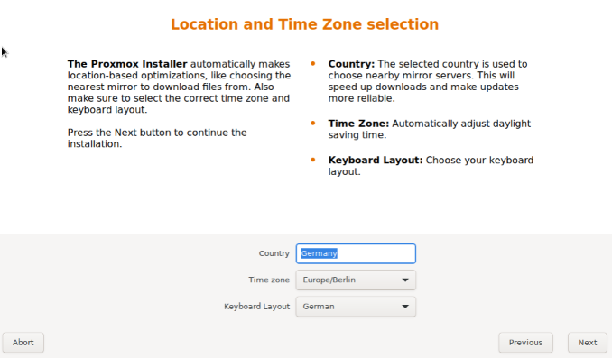

</详情>

然后输入 root 用户的密码。此处还要求提供电子邮件地址。用于在出现重要系统消息时向此处指定的地址发送电子邮件。但是，这不一定是真实的电子邮件地址（然后，作为管理员，您将不再通过电子邮件收到重要的系统事件通知）。

密码和电子邮件

</详情>

安装程序的下一步涉及网络设置。必须在此处输入静态 IP 地址（无 DHCP）。这包括 IP 地址本身（以 CIDR 表示法）、网关 IP（通常是路由器的 IP 地址）和要使用的 DNS 服务器（在私有环境中通常也是路由器的 IP 地址）。 Proxmox 通常会自动检测网络。

网络

</详情>

最后显示安装摘要：

概括

</详情>

通过检查设置并单击安装来安装系统。

安装

</详情>

稍等片刻后，安装完成，必须重新启动系统（预先拔出带有 ISO 映像的 USB 记忆棒）。

然后你就会看到终端。此处已显示有关如何访问系统的说明：

安慰

</详情>

现在它在浏览器中继续（例如 https://10.1.1.89:8006）。然而，首先会显示一条警告。这是因为在安装过程中生成了自签名证书，而浏览器当然不知道该证书。此时您可以安全地忽略此消息 - 无论如何，连接都是通过 HTTPS 加密的。消息本身取决于浏览器。在此示例中，单击“**高级**”，然后单击“**继续到 10.1.1.89（不安全）**”

隐私错误

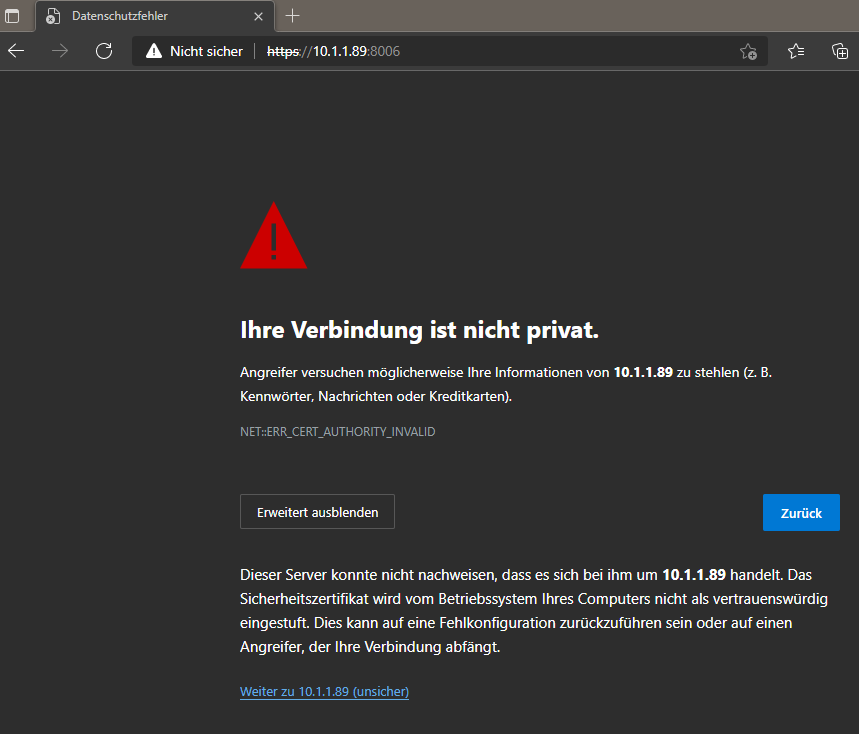

</详情>

然后使用 root 用户和安装期间选择的密码进行登录。您可以在这里**首先**将语言切换为德语，否则Proxmox界面将显示为英语，您无需再次输入用户名和密码。

登记

</详情>

登录后，您将立即收到一条消息，提示您没有该服务器的有效订阅。首先单击“确定”即可确认此消息。

订阅

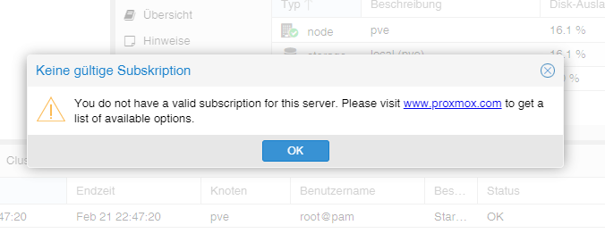

</详情>

现在必须调整 Proxmox 软件包源以便可以接收更新。

包来源

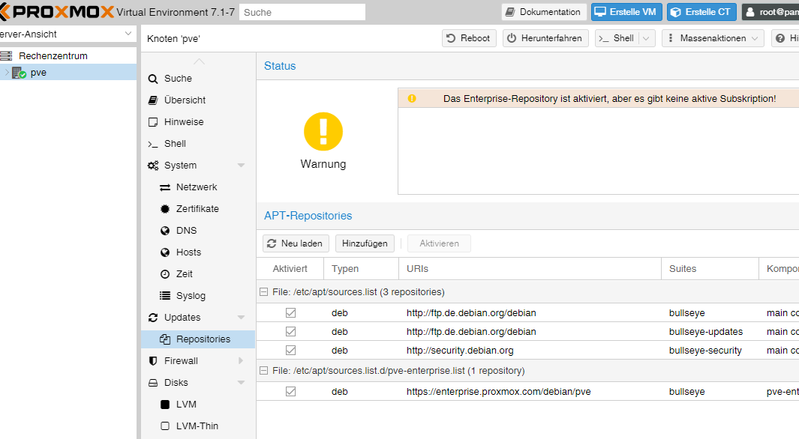

</详情>

为此，**Non-Subscription-Repository** 被添加到包源中。这可以在 Proxmox 实例菜单中的`Updates > Repositories`下完成。可以使用“添加”按钮添加非订阅存储库：

非订阅

</详情>

现在**企业存储库**应该被停用。为此，只需在存储库视图中选择 pve-enterprise 存储库，然后单击 **停用** 按钮。

存储库的配置如下所示：

企业存储库

</详情>

＃＃＃ 更新
更改软件包源后，应进行第一次系统更新。最好的方法是通过网络界面：

更新

</详情>

只需选择所需的 Proxmox 节点（例如“pve”），然后单击“更新”下的“**更新**”。这是所谓的任务查看器打开的地方，当系统上执行任何活动时，该查看器始终会显示。现在可以再次关闭任务查看器。顺便说一句，当显示任务查看器时，您不必等到任务完成（“任务确定”），但该对话框始终可以直接再次关闭 - 任务本身继续在后台运行。
如果现在有更新可用，则可以通过单击“**升级**”来导入它们。

Web 控制台将在此处打开，您可以监控进度。

网络控制台

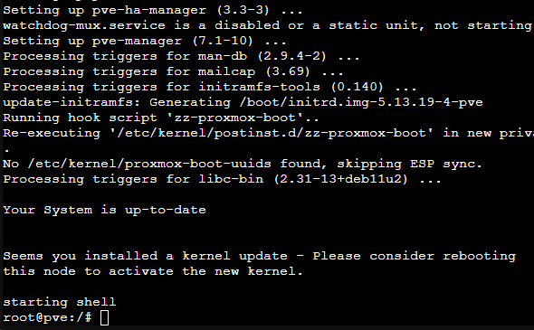

</详情>

当然也可以通过命令行（例如通过 SSH）更新 Proxmox 服务器：

~~~ apt update && apt dist-upgrade ~~~

这里唯一重要的是你使用 **apt dist-upgrade** （在“普通”Debian/Ubuntu 机器上，你倾向于使用 apt Upgrade）。然而，“dist 升级”对于 Proxmox 很重要，因为操作 Proxmox 所需的依赖关系在这里得到了更好的解决。

从这方面来看，Proxmox 的基本配置现已完成。如果您想更广泛地处理 Proxmox，值得一看[Proxmox Wiki](https://pve.proxmox.com/wiki/Main_Page) 或访问 [官方论坛](https://forum.proxmox.com/)。

---

## Proxmox - 创建虚拟 Qemu/KVM 机器 (VM) + 随后安装 ioBroker
本示例指南展示了如何创建 [虚拟机](https://pve.proxmox.com/wiki/Qemu/KVM_Virtual_Machines) (debian11)，然后在其中安装 ioBroker。

当然可以使用 Ubuntu 而不是 Debian，但请确保使用 Ubuntu 服务器 **LTS 版本**。

为了清楚起见，可以打开图像描述和附加信息。

### 1 - 下载 ISO 映像
首先，需要一个[ISO镜像](https://www.debian.org/distrib/)（64位PC Netinst-ISO），必须将其加载到基本安装中的根目录（本地）中（如果没有创建其他驱动器）。

为此，请转至本地 > ISO 映像。有两个选择。

- 之前存储在计算机上的 ISO 可以通过 **上传** 按钮加载到 Proxmox 主机上。
- **从 URL 下载** 可以通过 URL 将 ISO 直接上传到主机。为此，请复制 64 位 PC Netinst-ISO 的链接地址（鼠标右键），插入 URL 并单击 **查询 URL** 以检索它。最后单击“**下载**”，即可直接下载 ISO。

下载ISO

</详情>

### 2 - 创建虚拟机
单击蓝色按钮 **创建 VM** 将打开一个窗口，必须在其中进行以下设置。

- 一般：主机名和密码的分配，ID 已给出（以 100 开头），可以更改，但以后不能更改。
- 操作系统：存储选择（本地）和 ISO 映像（debian-11-netinst.iso）
- 系统：一切保持默认设置，**检查 Qemu Agent**
- 磁盘：存储local-lvm，磁盘大小10GB（10-20GB应该足够了，以后可以更改，但这里不再进一步描述）。
- CPU：取决于计算机的强大程度（也可以随时调整，为此必须重新启动VM）
- 内存：以 MiB 为单位的 RAM 大小（也可以随时调整，为此必须重新启动 VM）
- 网络：vmbr0，其他一切保持默认
- 确认：在这里您可以再次看到摘要（选中**创建后开始**），然后单击**完成**来创建虚拟机。

系列图像 创建VM

</详情>

### 3 - Debian 安装
VM 启动后，转到 VM 控制台并启动 **安装**。

安慰

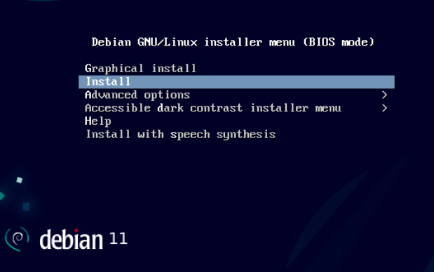

</详情>

您将被引导完成安装，并且必须在此过程中进行一些设置。要使用它，您需要制表符、空格键和箭头键。由于范围的原因，可以找到该系列图像的各种镜头。

**危险！ - 不得指定 root 密码。**

一个通知：

不要选择 **iobroker** 作为用户名，因为这已在内部使用。

图像系列 Debian 安装

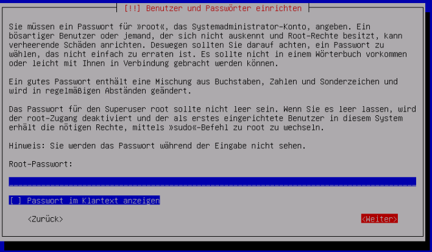

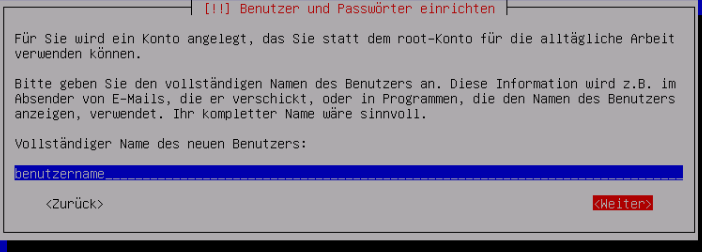

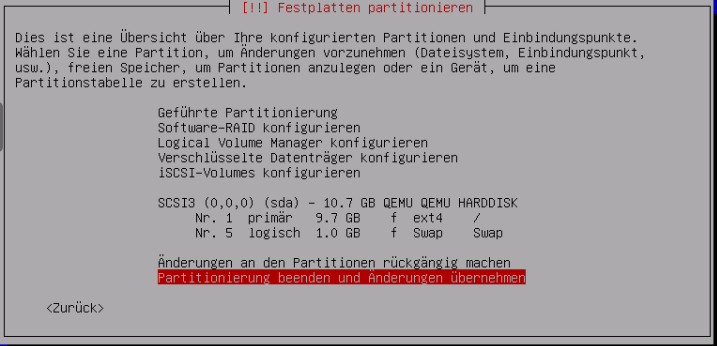

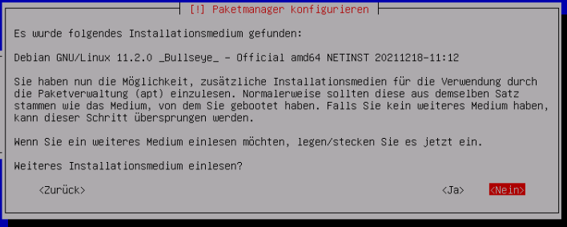

</详情>

### 4 - 设置虚拟机
重新启动 VM，然后使用安装时分配的“用户名”和“密码”登录。然后用命令

~~~ IP地址~~~

找到了IP地址。这是通过 ssh 远程连接到虚拟机所必需的，如下一步所示。

IP地址

</详情>

现在可以通过 ssh（例如 Putty）访问虚拟机。在这里您使用“用户名”和“密码”再次登录。
然后网络地址可以从**dhcp**更改为**静态**。 （推荐用于服务器操作）

~~~ sudo nano /etc/network/interfaces ~~~

网络/接口

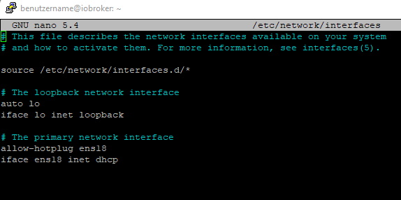

</详情>

使用组合键 CTRL + o 保存编辑器中的更改，然后按 ENTER，CTRL + x 退出编辑器。

对 IP 的更改仅在 VM 重新启动后才会生效。然而，在此之前，使用以下命令检查 Qemu Guest Agent 是否处于活动状态

~~~ sudo systemctl status qemu-guest-agent ~~~

客座代理

</详情>

**危险！ - 对于 Ubuntu 安装，必须安装并启动 Qemu Guest Agent..**

为此的命令：

~~~ sudo apt-get install qemu-guest-agent sudo systemctl start qemu-guest-agent ~~~

此外，为了能够安装 iobroker，必须随后安装 **curl**。
~~~ sudo apt安装curl ~~~

重新安装卷曲

</详情>

要传递 VM 中的设备 (USB)，请选择 VM > 硬件 > 添加 > USB 设备 > 供应商/设备 ID。此处列出了所有连接的设备。

USB设备

</详情>

为了使 VM 在计算机重新启动后自动启动 (Proxmox)，必须在 VM 选项中激活它。

启动选项

</详情>

这样就完成了虚拟机的安装和设置。现在可以重新启动VM，然后可以安装ioBroker。

---

## Proxmox - 创建 Linux 容器 (LXC) + 随后安装 ioBroker
本示例指南展示了如何创建 [LXC集装箱](https://pve.proxmox.com/wiki/Linux_Container) (debian11)，然后在其中安装 ioBroker。

为了清楚起见，可以打开图像描述和附加信息。

### 1 - 下载容器模板
首先需要一个模板，在基本安装时必须将其加载到根目录（本地）中（如果没有创建其他驱动器）。

为此，请转至本地 > 容器模板。单击“**模板**”将打开一个选择列表。在这里选择 debian-11-standard(bullseye) 并单击下载。

下载模板

</详情>

### 2 - 创建 LXC
单击蓝色按钮**创建 CT** 将打开一个窗口，现在必须在其中进行以下设置。

- 常规：分配主机名和密码，给出 ID（以 100 开头），但可以更改。
- 模板：存储选择（本地）和模板（debian-11-standard）
- 磁盘：分配磁盘大小（不要太大，可以随时放大）
- CPU：取决于电脑的强大程度（也可以随时调整）
- 内存：Ram/Swap 分配（可以随时调整，甚至在操作期间）
- 网络：静态 IP/CIDR 分配、网关，如果未设置 IPv6，则设置为 SLAAC
- DNS：通常不做任何更改（使用来自主机的值）
- 确认：摘要（勾选**创建后开始**），然后单击**完成**以创建容器。

图像系列 创建 CT

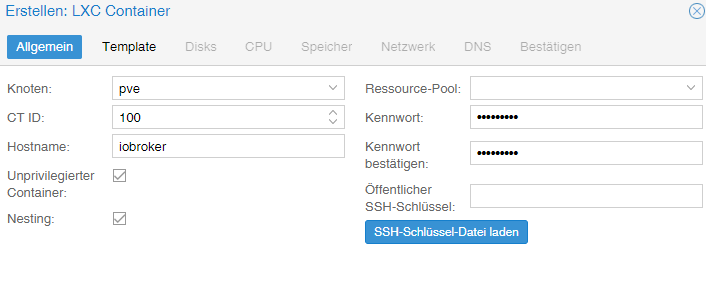

</详情>

### 3 - 设置 LXC
现在容器已经启动了，进入LXC的控制台

安慰

</详情>

在这里，您首先使用之前分配的密码（创建 LXC 时分配的密码）以 root 身份登录，并首先更新它。

~~~ apt 更新 && apt 升级 ~~~

升级

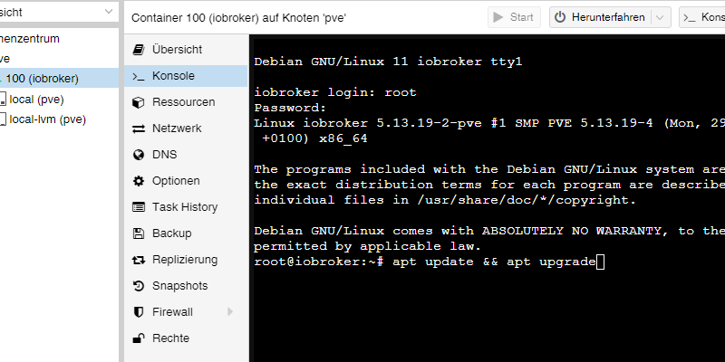

</详情>

直接指出时区还是要设置的。

~~~ dpkg-重新配置tzdata ~~~

时区

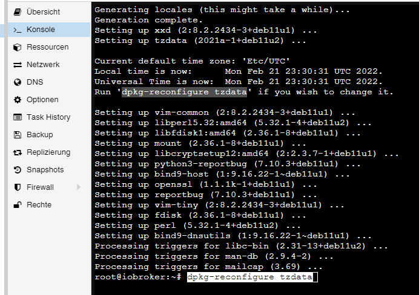

</详情>

现在 **sudo** 和 **curl** 将被安装。如下一步所示，需要 Sudo 才能正确创建将来用于在控制台上工作的用户。在最后一步中需要使用 Curl 来调用 ioBroker 安装脚本。

~~~ apt install sudo curl ~~~

重新安装

</详情>

现在创建未来用户。在这种情况下替换“用户名”。为用户分配密码。其余的可以用ENTER确认。

一个通知：

不要选择 **iobroker** 作为用户名，因为这已在内部使用。

~~~ 添加用户 用户名 ~~~

然后必须将用户分配到 sudo 组。

~~~ usermod -aG sudo 用户名 ~~~

创建用户

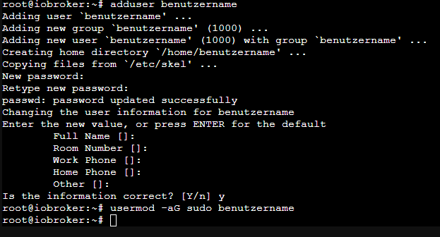

</详情>

最后一步，在安装ioBroker之前，注销一次

~~~退出~~~

然后用新用户登录。现在可以安装 iobroker。

注销并以用户身份登录

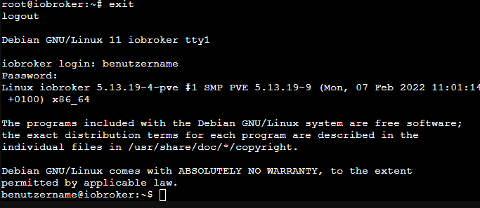

</详情>

为了使 LXC 在计算机（Proxmox）重新启动后自动启动，必须在容器选项中激活它。

启动选项

</详情>

---

## 安装 ioBroker
安装 ioBroker 所需的只是一个命令。

~~~curl -sLf https://iobroker.net/install.sh | bash-~~~

安装步骤分为4步，全自动运行。

- 安装先决条件 (1/4)
- 创建ioBroker用户和目录（2/4）
- 安装 ioBroker (3/4)
- 完成安装 (4/4)

安装人员

</详情>

当最后出现以下内容时表示安装成功。

~~~ ioBroker安装成功在浏览器中打开http://10.1.1.222:8081，开始配置！ ~~~

同时，这也意味着现在可以通过地址在浏览器中调用ioBroker。如果一切正常，没有任何问题，您将看到 ioBroker 设置。现在，助手将指导您完成几个步骤。

ioBroker 助手系列图片

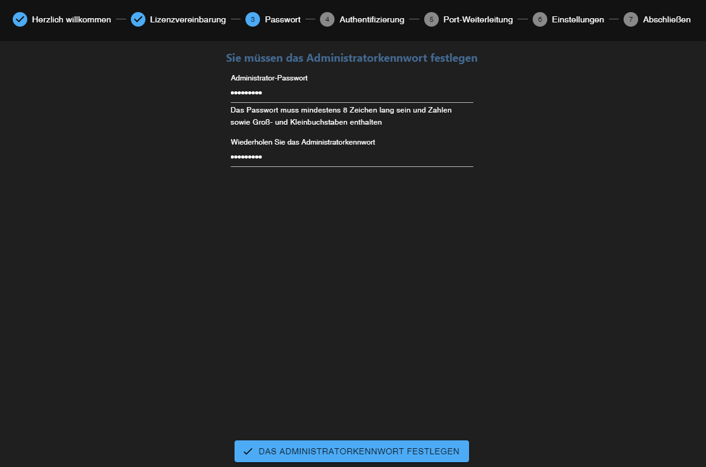

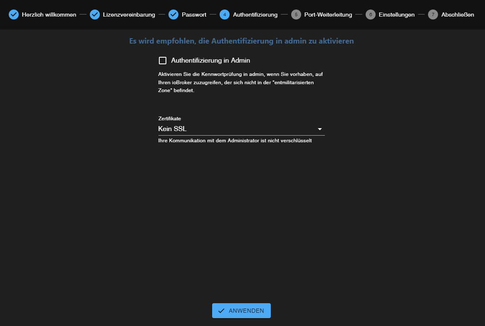

</详情>

然后您可以搜索设备和服务。可以自动创建所需的适配器/实例。

图片系列设备/服务搜索

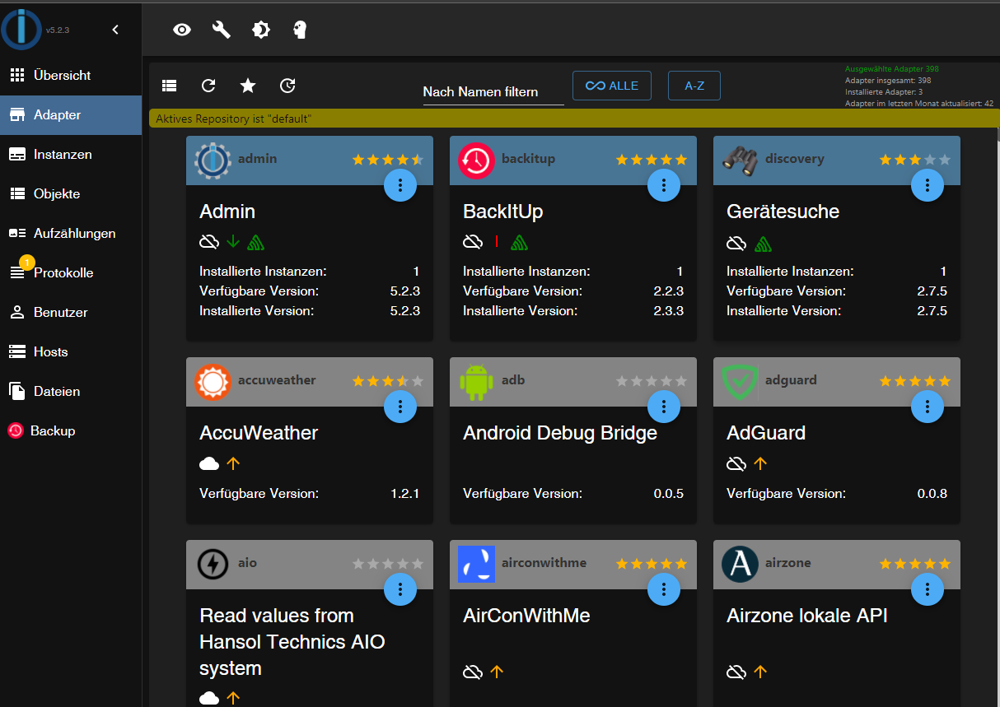

</详情>

这样就完成了ioBroker的安装。根据应用和需求，可以随时安装额外的适配器。

---

## Proxmox - LXC（Linux 容器）-> 通过 USB 设备
本指南的这一部分逐步解释了如何将 Proxmox 中的 USB 设备（USB 直通）传递到 LXC（Linux 容器）。

使用VM，可以直接通过Proxmox Web界面传递USB设备。使用Linux容器，目前必须为此手动编辑lxc的配置文件。

这些说明描述了如何集成 **Texas Instruments Inc. CC2531** Zigbee 棒，但相同的步骤也可类似地用于其他 Zigbee 棒（ConBee、CC2652P 等）或除 USB 网络设备之外的其他 USB 设备可以使用（蓝牙/WLAN）。

* 本部分说明使用 Proxmox 7.1 版。

### 1.) 收集有关 USB 设备的信息

建立与 Proxmox 的 SSH 连接：

~~~ ssh root@ip地址 ~~~

**如果 USB 设备已连接到 Proxmox 主机，请暂时拔下该设备。**

以下命令列出 Proxmox 主机上当前连接的所有 USB 设备：

~~~lsusb~~~

现在将要集成的USB设备插入Proxmox主机并再次执行lsusb命令

在屏幕截图中，您可以看到列出了 USB 总线编号：**001** 和设备编号：**003** 的新设备。

使用以下命令需要此信息，例如从设备输出**主设备号**：

~~~ ls -l /dev/bus/usb/001/003 ~~~

在命令中使用 USB 总线编号和设备编号的输出非常重要！

***ls -l /dev/bus/usb/usb 总线编号/设备编号***

本例中的 USB 设备的主设备号为 **189**，请在文本文件中记下设备的值并添加注释：#1

接下来我们输出 USB 设备的唯一 id，并在文本文件中用注释记下输出值：#2

~~~ ls /dev/serial/by-id/ ~~~

最后一步，输出 ttyACM 的主设备号并用注释注明：#3：

~~~ ls -l /dev/ttyACM* ~~~

>*如果没有输出，请使用“ls -l /dev/serial/by-id/”检查 USB 设备是否被系统集成为 ttyUSB，如果是，则替换所有引用 **ttyACM 的以下命令。 ..* * 从 **ttyUSB…** 获取，如果没有输出，则不是 USB CDC 类设备（串行通信），因此可以忽略从 ttyACM 包含的所有点。*

因此，我们在lxc的配置文件中记下集成所需的USB设备的**三个**值。

</详情>

### 2.) 编辑LXC配置文件

使用以下命令更改到 Proxmox 主机上的 LXC 配置目录：

~~~ cd /etc/pve/lxc ~~~

配置文件的 ID 号与创建 lxc 时分配的 ID 号相同！

在编辑配置文件之前，应创建备份副本：

~~~ cp 201.conf 201.conf.backup ~~~

现在使用 vi 或 nano 编辑配置文件：

~~~ Nano 201.conf ~~~

在配置文件末尾添加以下内容：

~~~ lxc.cgroup2.devices.allow：c 189：* rwm lxc.mount.entry：usb-Texas_Instruments_TI_CC2531_USB_CDC___0X00124B0012023529-if00 dev/serial/by-id/usb-Texas_Instruments_TI_CC2531_USB_CDC___0X001 24B0 012023529-if00 无绑定，可选，创建=文件

lxc.cgroup2.devices.allow: c 166:* rwm lxc.mount.entry: /dev/ttyACM0 dev/ttyACM0 none 绑定，可选，创建=文件 ~~~

将标记的值替换为笔记中注明的条目！

* 第一行指主设备号 **189** 注：#1
* 在第二行中，注：#2 中的唯一 id (usb-Texas_Instruments_TI_CC2531_USB_CDC___0X00124B0012023529-if00) 单独给出，并带有绝对路径，请注意，完整的文本写在一行中，没有换行符。
* 在第三行中，给出来自 Note: #3 的 ttyACM 的主设备号 **166**。

保存配置文件（在nano编辑器中使用组合键：CTRL + o & CTRL + x退出编辑器）

 

**危险！ - 如果您的容器有活动快照：**

那么 lxc.cgroup 代码不属于配置文件的末尾，而是属于快照的第一个条目之前。

</详情>

**危险！ - Proxmox 7.0 版本之前的安装：**

将条目替换为

~~~ lxc.cgroup2 ~~~

通过

~~~ lxc.cgroup ~~~

</详情>

  最后，发出以下命令来设置 ttyACM0 所需的权限：

~~~ chmod o+rw /dev/ttyACM* ~~~

要将调整应用于 lxc，请使用 **pct stop id / pct start id** 从容器执行冷启动：

~~~ pct 停止 201 ~~~

~~~ pct开始201 ~~~

 

**提示最好在外部存储工作配置文件的副本，因为例如B. 集成的 Proxmox 备份服务不会备份您的配置内容！**

 

</详情>

### 3.) 检查 LXC USB 直通和 Zigbee 实例配置

建立与 LXC 的 SSH 连接：

~~~ ssh 用户@ip 地址 ~~~

使用命令：

~~~lsusb~~~

&

~~~ ls -l /dev ~~~

检查配置文件调整是否成功。

* 如屏幕截图所示，容器现在可以访问 USB 设备。

* 重要的是ttyACM0在屏幕截图中具有相同的权限，即**crw-rw-rw- 1无人nogroup**

>***如果不检查配置文件中的所有值是否都按照描述设置，权限应该仍然不匹配然后跳转到第5点。***

* 屏幕截图还显示 cc2531 的设备编号已从 3 变为 4，这是因为在此期间棒已被拔出并再次插入。但是，由于在配置文件中指定了唯一 ID 而不是总线/设备编号，因此 USB 直通将继续工作。

如果如上所述，将 Zigbee 棒传递到容器，则必须在 Zigbee 适配器设置的 iobroker 中的 COM 端口名称下输入它

~~~ /dev/ttyACM0 ~~~

指定以便适配器寻址正确的设备。

</详情>

### 4.) 永久权限的UDEV规则 ttyACM0的调整

在第 3 步结束时使用命令

~~~ chmod o+rw /dev/ttyACM* ~~~

为 ttyACM0 设置了适当的权限，但这些权限更改会在 Proxmox 主机重新启动时重置。Proxmox 主机上需要 udev 规则才能进行永久调整。

使用 lsusb 我们再次列出当前连接的 USB 设备：

~~~lsusb~~~

这次我们记下ID后面的数值，所以在本例中**0451:16a8**

* 第一个值：***0451*** 代表 **idVendor**，第二个值：***16a8*** 代表 **idProduct**。

现在使用 vi 或 nano 在 /etc/udev/rules.d 下创建 udev 规则：

~~~ 纳米 /etc/udev/rules.d/50-myusb.rules ~~~

并添加了以下内容：

~~~ 子系统==“usb”，ATTRS {idVendor} ==“0451”，ATTRS {idProduct}==“16a8”，GROUP =“用户”，MODE =“0666”~~~

最后，运行以下命令激活udev规则：

~~~ udevadm 控制 --reload ~~~

</详情>

### 5.) 故障排除

**错误：** lxc 中的 ttyACM0 权限不匹配或在短时间内丢失（ConBee II）。

~~~ ls -l /dev/ttyACM0 c--------- 0 无人 nogroup 166, 0 二月 7 日 14:29 ttyACM0 ~~~

 

**解决方案：** 使用 mknod 为容器创建持久绑定。

为此，在路径 **“/var/lib/lxc/CONTAINERID”** 中创建 **devices** 文件夹，并使用 mknod 在此文件夹中创建绑定：

~~~ mkdir /var/lib/lxc/201/devices ~~~

~~~ cd /var/lib/lxc/201/devices ~~~

~~~ mknod -m 666 ttyACM0 c 166 0 ~~~

+ *mknod 在路径中创建名为 ttyACM0 的文件（只要该文件存在，设备就绑定到 lxc）*

***主要设备号和ttyACM..必要时进行调整***

然后必须调整lxc配置文件中的条目：

~~~ lxc.mount.entry: /dev/ttyACM0 dev/ttyACM0 无绑定，可选，创建=文件 ~~~

被替换为：

~~~ lxc.mount.entry: /var/lib/lxc/CONTAINERID/devices/ttyACM0 dev/ttyACM0 none 绑定，可选，创建=文件 ~~~

</详情>

---

## 设置 USB 记忆棒/磁盘用于备份
为了以后可以单独保存备份，可以选择在 Proxmox 主机上以棒或磁盘的形式集成 USB 设备。
为此，设备必须具有特定的格式。
常见的[文件系统](https://wiki.ubuntuusers.de/Dateisystem/)是**vFAT**或**NTFS**。两者都可以在 Linux、Windows 或 MacOS 上读取。
对于纯 Linux，通常是 **EXT4**。

如果数据介质仍未分区或者您想重新格式化它，您可以在 Windows PC (ntfs) 上或直接在 Proxmox 服务器上执行此操作。
准备好数据介质后，就可以将其安装到系统中，然后通过 Proxmox Gui 直接添加为存储（目录）。

**危险！ - 采用新格式后，数据介质上所有以前的数据都将被删除

以下示例说明直接参考 Proxmox 主机上的设置。也可以使用 ssh/putty。

**注意，以下命令需要 root，如果在主机上使用自定义用户，则以下命令必须以 sudo 为前缀。**

### 准备设备
### 1 - 识别设备
首先，您找到带有 [LSBLK](https://wiki.ubuntuusers.de/lsblk/) 的设备。建议在插入之前和之后运行该命令一次。这使得识别设备变得更加容易。

~~~ lsblk ~~~

看起来像这样（字母根据连接的设备数量而变化）

~~~ sdd 8:48 0 119.2G 0 磁盘 ├─sdd1 8:49 0 119.2G 0 部分 └─sdd9 8:57 0 8M 0 部分 sde 8:64 0 931.5G 0 磁盘 <-- 这是磁盘 / dev/sde └─sde1 8:65 0 931.5G 0 部分 <-- 这是第一个分区 /dev/sde1 如果已经格式化 sr0 11:0 1 1024M 0 rom sr1 11:1 1 1024M 0 rom ~~~

### 2 - 分区
驱动器通过菜单驱动的[cfdisk](https://wiki.ubuntuusers.de/fdisk/)进行分区

~~~ cfdisk /dev/sde ~~~

### 3 - 创建文件系统
现在必须格式化之前创建的分区。如上所述，根据预期用途，有不同的选择。
使用命令[MKFS](https://wiki.ubuntuusers.de/Formatieren/)和适当的参数格式化分区。

~~~ mkfs.vfat /dev/sde1 ~~~

### 4 - 安装驱动器
为了能够使用完整的数据介质，它必须是[安装的](https://wiki.ubuntuusers.de/mount/)。

为此创建了一个合适的安装点，以便在重新启动后重新自动集成数据介质，您还需要在[/etc/fstab](https://wiki.ubuntuusers.de/fstab/)中添加一个合适的条目。

为此，必须读出驱动器的唯一 **UUID**。

创建挂载点~~~ mkdir /media/ext_usb ~~~

挂载媒体 ~~~ 挂载 /dev/sde1 /media/ext_usb ~~~

获取 UUID ~~~ blkid | grep -i sde ~~~ 给出 ~~~ /dev/sde1: LABEL="Export_Images" UUID="136b058d-f0c8-406d-a82b-2adcc00b72bf" UUID_SUB="951e8519-8478-4d64-b093-c3597147f989" BLOCK_SIZE="第4096章 类型=“btrfs”PARTUUID=“00011a10-01”~~~

使用 nano 编辑 */etc/fstab* 中的条目 ~~~ nano /etc/fstab ~~~ 现在添加并保存此条目 ~~~ UUID="136b058d-f0c8-406d-a82b-2adcc00b72bf" /media/ ext_usb vfat 默认 0 0 ~~~

### 5- 在 Proxmox 中添加存储
现在可以在数据中心>存储下添加目录。 ID名称可以自由选择，例如*usb-backup*。

路径在 *Directory* 列中指定，在本例中为 */media/ext_usb*。

使用*内容*，您只需选择所需的请求。